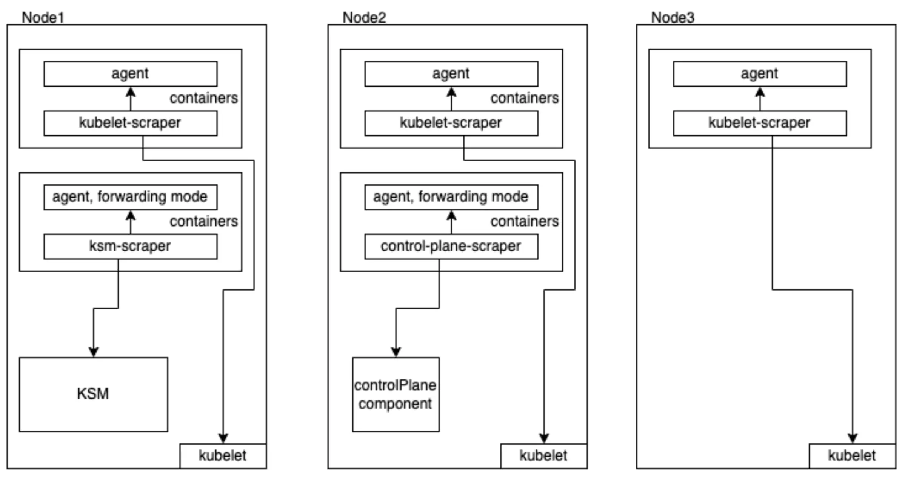

In April of 2022, we re-architected our Kubernetes integration, making it modular and configurable, giving you more flexibility and compatibility with more environments. Upgrade today to get access to the following:

* **Reduce memory footprint**: Up to 80% reduction in big clusters.
* **Improve troubleshooting**: Easier to triage bugs and fix issues with enhanced logs and process cycle.
* **Configure more easily**: Three individually-configurable components, including support for config files that provide more granular settings.
* **Scrape external control planes**: Get metrics from components outside your clusters.
* **Adjust scraping intervals**: Dial-up or dial-down data ingest to suit your needs.

## How to get started

To learn more, check out our [blog](https://newrelic.com/blog/nerdlog/k8s-integration-v3) or go straight to the [docs](https://docs.newrelic.com/docs/kubernetes-pixie/kubernetes-integration/get-started/changes-since-v3/#migration-guide) to get started.

