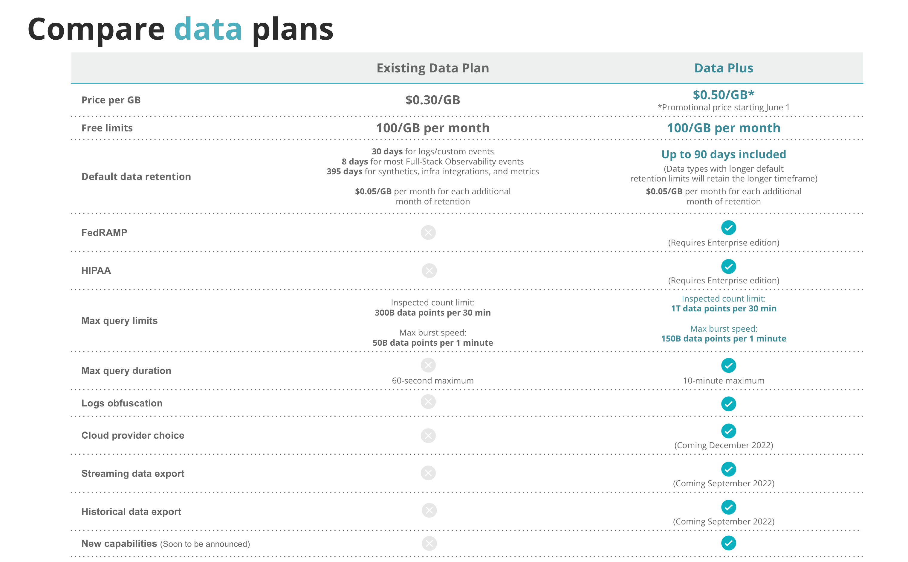

## Introducing Data Plus (New!) 

Starting June 1, 2022, customers on our [New Relic One pricing model](https://docs.newrelic.com/docs/accounts/original-accounts-billing/original-product-based-pricing/overview-pricing-models) will be able to choose between the existing data offering and a new "Data Plus" offering, listed at the promotional price of $0.50/GB ingested (includes $1.15/GB of value), to avoid ballooning data costs when scaling your observability practice. 

Data Plus combines at-scale performance and governance capabilities in one simple, predictable, and affordable price per gigabyte which is 56%+ more cost effective than paying for each capability individually. The Data Plus offering includes: 

* **90 days extended retention over current defaults:** Instead of paying individual premiums for data indexing and retention of each data source, customers will be able to choose which data they want stored longer in New Relic without increasing their monthly costs. 
* **3x the max query limit and 10x the max duration per query:** Engineers can analyze large data volumes faster, with the ability to inspect up to one trillion data points per 30 minutes and 100 billion data points per minute, compared to 300 billion data points per 30 minutes and 10 billion data points per minute in the current data offering. In addition, New Relic Data Plus customers benefit from an increased max query duration of up to 10 minutes, versus 60 seconds in the existing data plan.
* **FedRAMP and HIPAA compliance:** New Relic Data Plus provides options for customers in highly regulated sectors to enable security configurations required for FedRAMP and HIPAA compliance. (Requires Enterprise edition.)
* **Logs obfuscation:** Engineers can track logs obfuscation rules directly in the log management UI and create anonymous identifiers for sensitive log data such as personally identifiable information (PII), access tokens, and other private or regulated data.
* **Enhanced streaming and historical data export** (coming soon): Ability to export New Relic data to external destinations for historical analysis and modeling, long-term storage, and integration with other data analytics platforms.

## Data ingest list price update 

Starting June 1, 2022, we’re increasing our existing listed data ingest price from $0.25/GB to  $0.30/GB per month. This does not apply to existing New Relic customer contracts and only applies to customers when they renew or modify their contracts. 

We're increasing the price so that we can continue to deliver more value for every GB you send to New Relic. Over the past two years, we have increased our engineering investments to deliver new capabilities included in your per GB price:

* **More data sources:** We have included 450+ I/O integrations at no additional cost for every plan. We plan to deliver even more innovations bundled with our data ingest price this year.
* **Better querying and visualizations:** We have invested to significantly improve the way users synthesize and correlate all of their data in seconds through query and dashboard enhancements, which are included for free with every account.
* **More efficient data processing:** We are committed to do the right thing and filter less useful data as shown by our recent reduction in [infrastructure agent costs](https://docs.newrelic.com/whats-new/2021/12/whats-new-12-15-InfraEC2LowerCosts). We plan to continue to drive down inefficiencies to make every GB count.

With this update, we are looking forward to accelerating our investments to deliver more value to you.

## Questions? Check out these FAQs

**Q: When is the list price update going into effect?**

The list price will be effective June 1 for all new customers. All customers will be notified of this change on April 14th.

**Q: How will the price update impact my bill?**

* Existing customers will continue their current data ingest billing rate until their next renewal, after which they will see an increase based on their contractual terms.  
* Free customers will see no change to their plan. If customers would like to ingest more than 100GB per month, they can upgrade to a paid plan, which will include the new $0.30 per GB per month price.
* Existing paid self-serve customers will not see an immediate ingest price increase on June 1, 2022, unless they cancel and restart their account. These customers are expected to start being billed at the new list price after they renew their current contract. 

**Q: How do the two offerings compare?**

**Q: Where can I see my current data usage?**

To view and analyze your current data usage, see the [data management UI](https://docs.newrelic.com/docs/data-apis/manage-data/manage-your-data).
