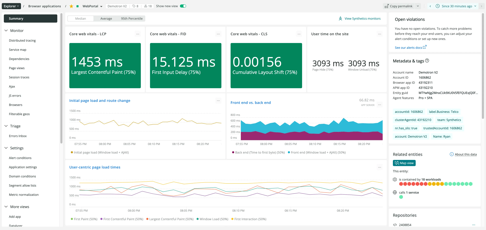
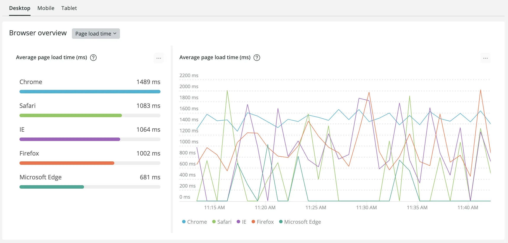
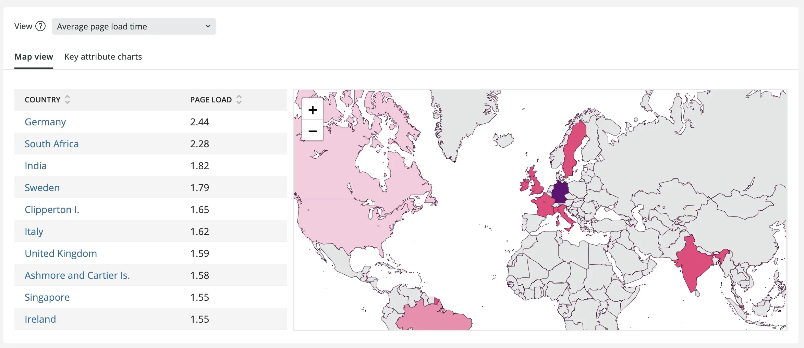

New Relic browser monitoring is an all-in-one solution that helps frontend, full-stack, and web developers measure and improve application performance and end-user responsiveness. We’ve recently added some new features to our browser monitoring experience so you can easily troubleshoot and optimize your frontend applications. Check out our updates:

We have natively incorporated Google’s Core Web Vitals into the browser monitoring UI so you can immediately visualize and analyze your application’s load performance, responsiveness, and layout stability. If your site unexpectedly slows down or crashes, frontend engineers can find the problem and dive deeper into the issue without context switching.

You can filter your user traffic across desktop, mobile, and tablet device types, and use our intuitive filterable geography offering to hone in on user data trends that are region-specific.

These both are particularly useful as you debug and optimize your frontend experiences, because you can analyze more granular data. For example, you might see whether Firefox or Chrome contribute to higher page load time when your application is accessed on desktops.

Or, if it's unclear which regions are experiencing higher than normal page load times, filterable geography can assist in tracking down the root of the problem.

These new features can help you quickly detect issues in webpage performance and may prove very useful in dynamic environments where scaling quickly is a priority.
