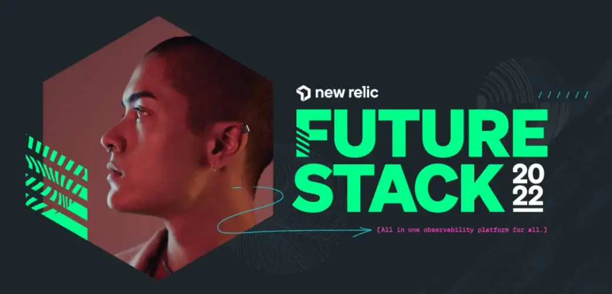

At FutureStack 2022, we announced more than 30 capabilities that make it even easier for your teams to monitor, debug, and improve your entire stack—and embed observability practices and telemetry data throughout the entire software development lifecycle. The lineup included:

* Logs in context
* Vulnerability management
* Azure multi-cloud support
* Alert notifications upgrade
* Enhanced NRQL querying

...and more.

Our comprehensive recap covers everything we announced at this year's event, and how you can get started with each New Relic enhancement and feature. [Read the recap blog now](https://newrelic.com/blog/nerdlog/futurestack-2022-recap).

