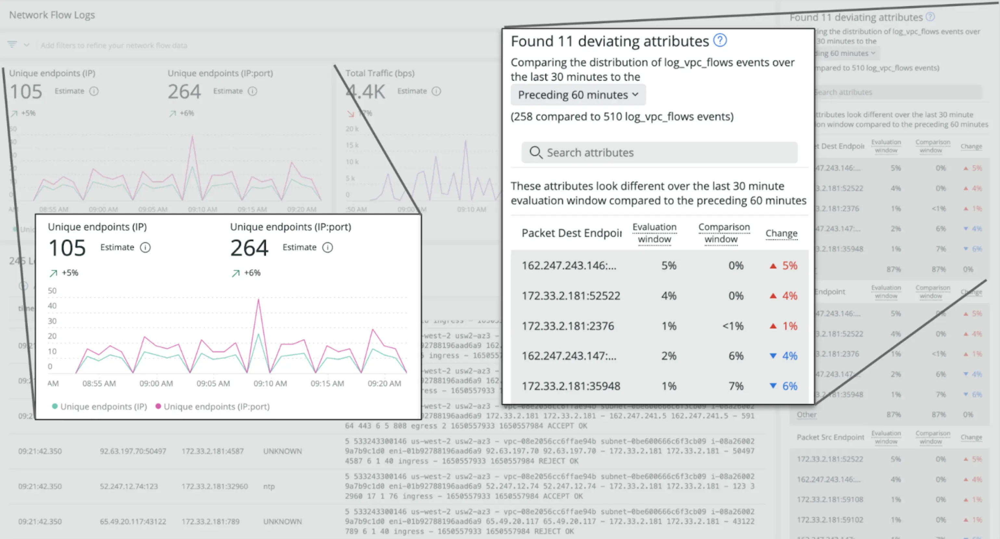

Welcome to an entirely new network monitoring onboarding experience, landing pages, and curated UIs, helping you understand and analyze your network monitoring telemetry. These new capabilities help you get started quickly by identifying the network-related use cases that are important to your business, onboarding the right network telemetry to address your use cases, and giving you a curated landing page that helps you analyze and understand this newly-ingested telemetry. With these new capabilities, you get:

* Guided, prescriptive onboarding experiences aligned to solving real problems.
* Purpose-built landing pages that highlight key network performance metrics.
* Curated visualizations for analyzing network performance (no network engineering experience required).

# Get started

To learn more, read the [blog](https://newrelic.com/blog/nerdlog/curated-npm-ui).

