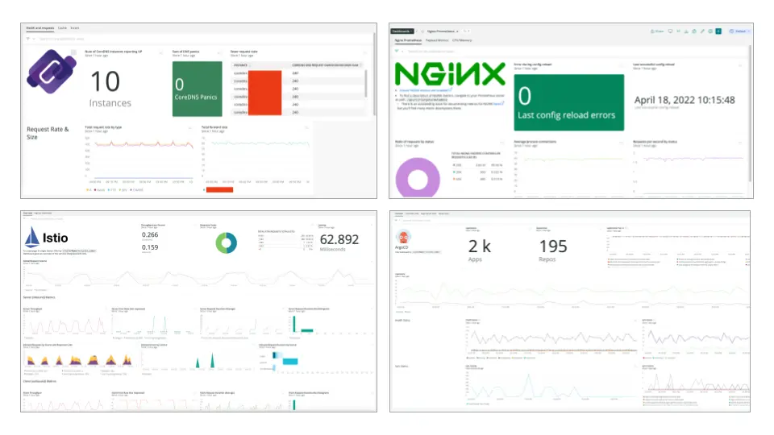

[New Relic Instant Observability](https://newrelic.com/blog/nerdlog/instant-observability-quickstarts) helps you instrument, monitor, and analyze your stack in minutes with hundreds of pre-built quickstarts. If your tech stack includes Kubernetes or Prometheus you can benefit from an easy instrumentation experience, curated dashboards, and pre-configured alerts for Istio, ArgoCD, CoreDNS, NGINX, Redis, and the Prometheus Node Exporter.

The latest quickstarts to help you get started with Kubernetes and Prometheus observability include:
* [Istio Service](https://onenr.io/08jqW5pmOwl): get a dashboard view of services running in your Kubernetes cluster using an Istio Service Mesh. Learn how to [monitor service mesh performance](https://newrelic.com/blog/how-to-relic/monitoring-istio-service-mesh) from our blog.
* [ArgoCD](https://one.newrelic.com/marketplace/catalog-pack-details/detail?state=30979e34-1782-6d4d-1b9a-57bdb3ba74fd): see the performance and availability of the ArgoCD platform within Kubernetes.
* [CoreDNS](https://onenr.io/0PwJp5o4Lj7): visualize CoreDNS performance and alert on potential errors. CoreDNS is a critical Kubernetes cluster component and can be difficult to troubleshoot in an error scenario, learn [how to monitor CoreDNS](https://newrelic.com/blog/how-to-relic/monitor-coredns) from our blog. 
* [NGINX Ingress Controller](https://onenr.io/0Zw0ZmVlejv): monitor performance and alert on potential configuration errors. 
* [Redis](https://onenr.io/0ERz3W2Xpjr): discover all critical performance and health metrics relevant to your Redis system monitored by Prometheus.
* [Prometheus Node Exporter](https://onenr.io/0bRmDEd1Bwy): dashboard view for host metrics gathered through Node Exporter.

Learn more about integrating [Kubernetes](https://docs.newrelic.com/docs/kubernetes-pixie/kubernetes-integration/installation/kubernetes-integration-install-configure/) and [Prometheus](https://docs.newrelic.com/docs/infrastructure/prometheus-integrations/get-started/send-prometheus-metric-data-new-relic/) with New Relic.
