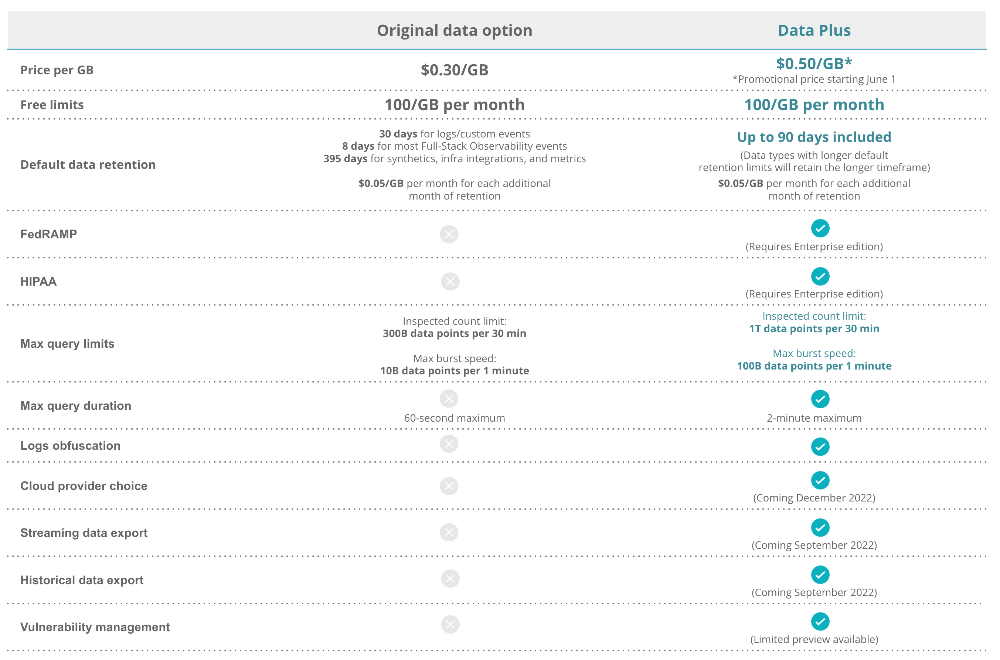

Today, we launched our new Data Plus option to help teams of all sizes scale their observability practices with advanced data capabilities, such as extended retention, logs obfuscation, increased query limits, FedRAMP/HIPAA compliance options, and more.

New Relic customers can now choose between the [existing data option](https://docs.newrelic.com/docs/data-apis/manage-data/manage-data-coming-new-relic/) ($0.30/GB) and the new [Data Plus](https://newrelic.com/blog/nerdlog/data-plus-pricing) option. Data Plus is listed at the promotional price of $0.50/GB ingested: a 56% bundled discount compared to using each capability individually.

Data Plus from New Relic includes:

* **Up to 90 days of data retention:** Instead of paying individual premiums for data indexing and retention of each data source, customers will be able to choose which data they want stored longer in New Relic without increasing their monthly costs.
* **Up to 3x the max query limits and 2x the max query duration:** Engineers can inspect up to one trillion data points per 30 minutes and 100 billion data points per minute (compared to 300 billion data points per 30 minutes and 10 billion data points per minute for the original data option). In addition, Data Plus customers get a max query duration of up to 2 minutes (compared to 60 seconds for the existing data option).
* **FedRAMP and HIPAA compliance:** Data Plus provides options for customers in highly regulated sectors to enable security configurations required for FedRAMP and HIPAA compliance. (Requires Enterprise edition.)
* **Logs obfuscation:** Engineers can track logs obfuscation rules directly in the log management UI and create anonymous identifiers for sensitive log data, such as personally identifiable information (PII), access tokens, and other private or regulated data.
* **Cloud provider choice (coming soon):** Flexibility to run observability workloads on the cloud provider of your choice, AWS or Microsoft Azure, to align your telemetry storage with your engineering deployment model and cloud preference. 
* **Enhanced streaming and historical data export (coming soon):** Ability to export New Relic data to external destinations for historical analysis and modeling, long-term storage, and integration with other data analytics platforms.
*  **Vulnerability management (coming soon):** Easily aggregate existing security data from third-party tools alongside vulnerabilities detected by New Relic to understand security signals and address vulnerabilities across your entire stack.  

For more information, read [the full announcement here](https://newrelic.com/blog/nerdlog/data-plus-pricing) or see [the Data Plus docs](https://docs.newrelic.com/docs/accounts/accounts-billing/new-relic-one-pricing-billing/data-ingest-billing#data-prices). To enable Data Plus, talk to your account representative.

## Data ingest list price update 

Today, we're increasing our existing listed data ingest price from $0.25/GB to $0.30/GB per month. This does not apply to existing New Relic customer contracts and only applies to customers when they renew or modify their contracts.

We're increasing the price so that we can continue to deliver more value for every GB you send to New Relic. Over the past two years, we have increased our engineering investments to deliver new capabilities included in your per-GB price:

* **More data sources:** We've included [450+ I/O integrations](https://newrelic.com/instant-observability) at no additional cost for every plan. We plan to deliver even more innovations bundled with our data ingest price this year.
* **Better querying and visualizations:** We have invested to significantly improve the way users synthesize and correlate all of their data in seconds through query and dashboard enhancements, which are included for free with every account.
* **More efficient data processing:** We're committed to do the right thing and filter out less useful data, as shown by our recent reduction in infrastructure agent costs. We plan to continue to drive down inefficiencies to make every GB count.

With this update, we're looking forward to accelerating our investments to deliver more value to you.

## Questions? Check out these FAQs

**Q: When is the list price update going into effect?**

[Initial notifications](https://docs.newrelic.com/whats-new/2022/04/whats-new-4-14-data-updates) went out on April 14, and the list price is effective as of June 1 for new customers.

**Q: How will the price update impact my bill?**

Existing customers will continue their current data ingest billing rate until their next renewal, after which they'll see an increase based on their contractual terms.

Customers on the free tier will see no change to their plan. If customers would like to ingest more than 100GB per month, they can upgrade to a paid plan, which will include the new $0.30 per GB per month price.

Existing paid self-serve customers will not see an immediate ingest price increase on June 1, 2022, unless they cancel and restart their account. These customers are expected to start being billed at the new list price after they renew their current contract.

**Q: How do the two offerings compare?**

**Q: Where can I see my current data usage?**

To view and analyze your current data usage, go to the [data management UI](https://docs.newrelic.com/docs/data-apis/manage-data/manage-your-data).
