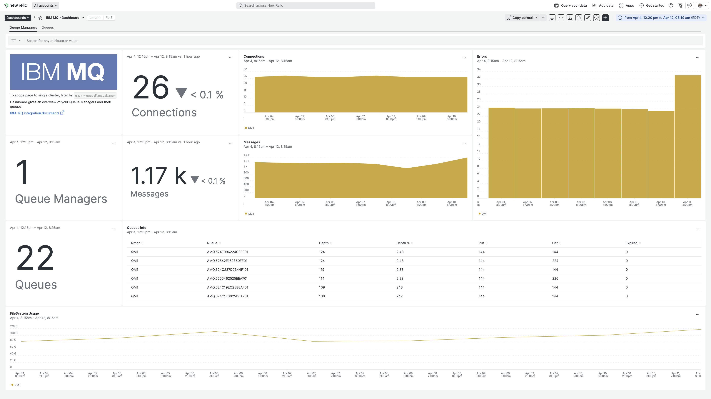
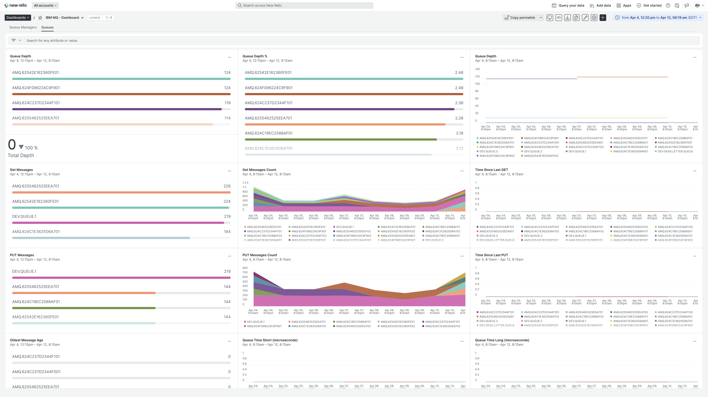

## We want you to get the message!
Introducing the public preview for our IBM MQ integration to monitor the performance of MQ objects like channels and queues. Analyze metrics over time to scale accordingly and keep your messages flowing.

## Instant Observability
Install the public preview to instrument your IBM MQ infrastructure. It comes with a pre-built dashboard visualization:
* Total of Connections
* Connections by Queue Manager
* Total of Errors
* Errors by Queue Manager
* Total of Messages
* Messages by Queue Manager
* Messages by Queue
* Queue Depth
* Expired messages by Queue
* Filesystem usage

## Get started now
Head over to the [IBM MQ quickstart located within Instant Observability](https://newrelic.com/instant-observability/ibmmq/924fd4b3-a6d1-4a6e-9e2c-b598f197f713) for installation instructions for this public preview integration. Or, if you would like more detail, check out the [IBM MQ documentation page](https://docs.newrelic.com/docs/infrastructure/host-integrations/host-integrations-list/ibmmq-monitoring-integration/).
