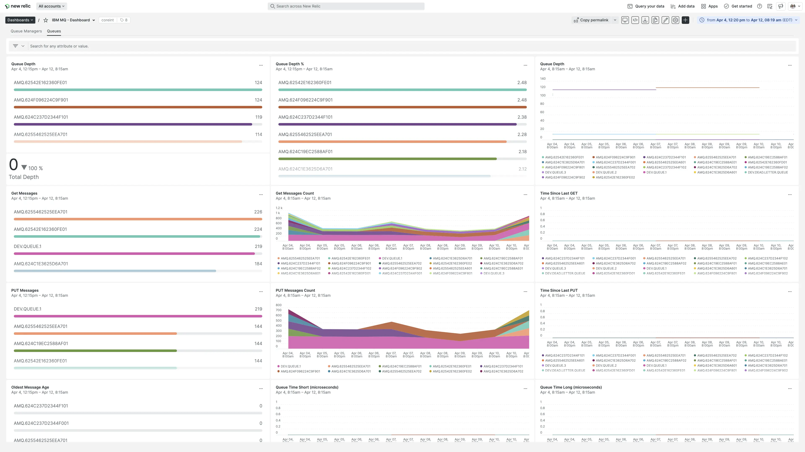

Introducing the public preview for our IBM MQ integration to monitor the performance of MQ objects like connections, channels, and queues. Analyze metrics over time to scale accordingly and keep your infrastructure messages and data flowing throughout your stack.

IBM MQ enables decoupled applications and services to communicate and exchange data in a reliable and scalable way, whether you're trying to integrate applications running in different frameworks, languages, platforms, clouds, or locations. 

## Instant observability

Install the public preview to instrument your IBM MQ infrastructure. It comes with a pre-built dashboard visualization providing key insights into the following metrics:

* Total of connections
* Connections by queue manager
* Total of errors
* Errors by queue manager
* Total of messages
* Messages by queue manager
* Messages by queue
* Queue depth
* Expired messages by queue
* Filesystem usage

## Get started now

Head over to the [IBM MQ quickstart located within Instant Observability](https://newrelic.com/instant-observability/ibmmq/924fd4b3-a6d1-4a6e-9e2c-b598f197f713) for installation instructions for this public preview integration. Or, if you would like more detail, check out the [IBM MQ documentation page](https://docs.newrelic.com/docs/infrastructure/host-integrations/host-integrations-list/ibmmq-monitoring-integration/).
