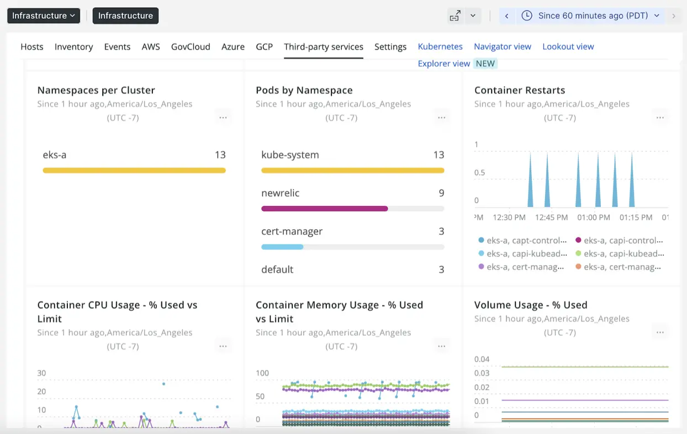

## Use on-prem infrastructure backed by AWS!
Amazon EKS Anywhere on bare metal lets you drive consistency backed by AWS while still leveraging your existing infrastructure bare metal investments on-premises.

## How does New Relic work with Amazon EKS Anywhere on bare metal?
Leveraging New Relic as your observability platform can simplify monitoring of your dynamic Kubernetes environment. Whether your Amazon EKS clusters are deployed in the cloud or your own data center, you will get the insight and confidence that workloads are running as optimal as possible. With New Relic, we bring perspectives designed especially for Kubernetes application developers and engineers delivering Kubernetes enterprise-level services, so that you can get real-time insights into your containerized workloads and set up prompt notifications for when issues occur.

New Relic and Pixie support a guided install, HELM or manifest method, so that data is quickly populated throughout the platform. The [New Relic Kubernetes cluster explorer](https://docs.newrelic.com/docs/kubernetes-pixie/kubernetes-integration/understand-use-data/kubernetes-cluster-explorer/) will immediately show you the health and status of your nodes and pods. Any state changes would be identified and can be acted upon. Further analysis is available through Pixie or with tight integrations across the platform.

<figcaption>Kubernetes detailed view</figcaption>

## Get started now
Learn how New Relic offers observability for your [Kubernetes environments](https://docs.newrelic.com/docs/kubernetes-pixie/kubernetes-integration/get-started/introduction-kubernetes-integration/). Or, if you're ready to add your environment, check out the [Kubernetes quickstart installation guided install](https://one.newrelic.com/catalog-pack-details?state=30e80071-6fdf-2f08-e76d-8c737005977e).
