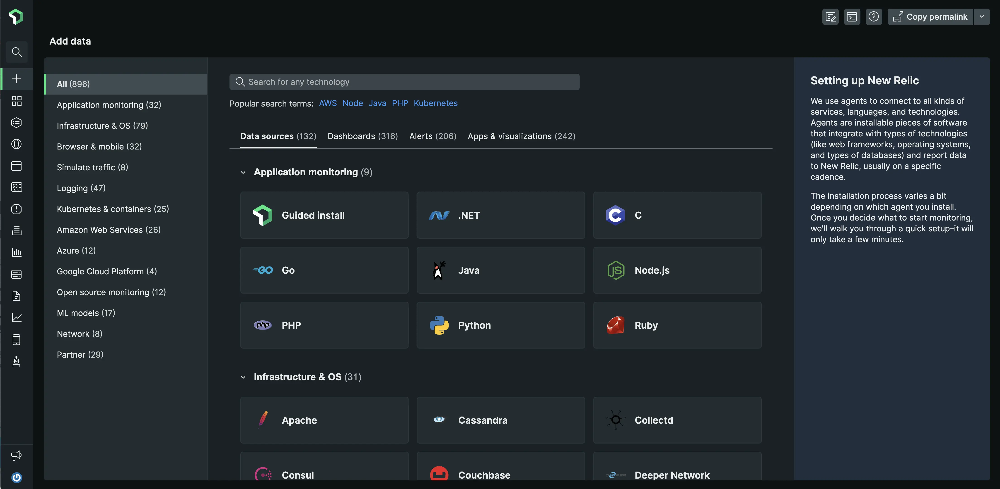

## Get started faster
Telemetry data is powerful to help you gain observability into your applications, network, infrastructure, and more. But instrumenting it all can be a pain with countless proprietary agents and integrations to manually install.

That's why we've designed the data onboarding experience in New Relic to make it easier, more flexible, and more connected to the right observability platform experiences&mdash;to help you get more value from your data.

## Demo
The best part is that it only takes a few minutes to get started&mdash;no need for specialized instrumentation expertise. See a demo in the video below:

<iframe width="560" height="315" src="https://www.youtube.com/embed/6U-RQIkBJOA" title="YouTube video player" frameborder="0" allow="accelerometer; autoplay; clipboard-write; encrypted-media; gyroscope; picture-in-picture" allowfullscreen></iframe>

## New features
- **Improved discovery and onboarding**: A new user interface guides you through each step of installation and deployment based on your preferred technologies, with hundreds of data sources to choose from.
- **New install method support**: Get more flexibility when instrumenting your data, to seamlessly and successfully monitor your applications regardless of whether they run on hosts, providers, Docker, or other environments.
- **A richer, more connected platform experience**: It's now easier to get more value from your data. Go directly from instrumentation to the most relevant New Relic view such as application management, log management, or infrastructure monitoring.
- **A single place to install anything**: Instrument data sources, deploy ready-made dashboards, set up alerts, or do it all. The new **Add data** view gives you more granular control over what you install and how you explore your stack so you can focus on the job to be done.

<figcaption>Choose from hundreds of data sources, pre-built dashboards, and more in the new <b>Add data</b> catalog. Select one to install your resources in minutes.</figcaption>
