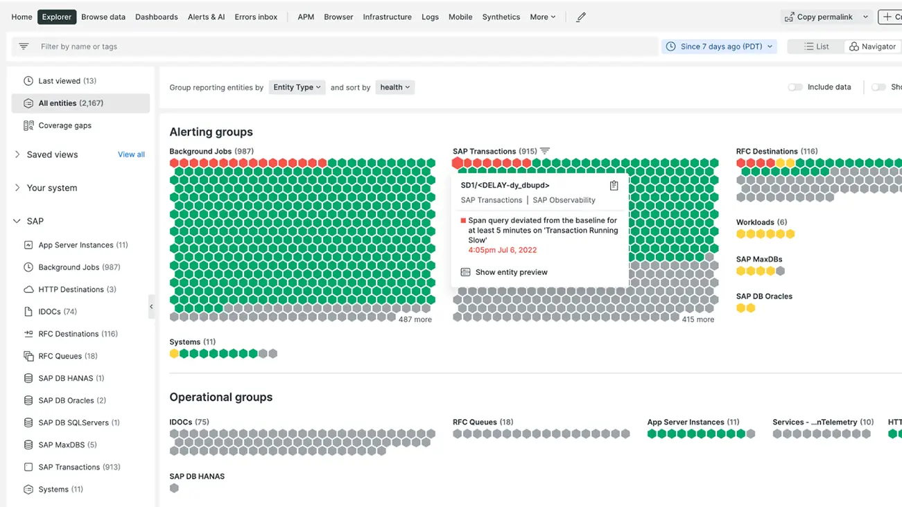

Recently, we launched [New Relic Monitoring for SAP Solutions](https://newrelic.com/solutions/sap), where you can now inspect all of your SAP and non-SAP systems through one centralized view of your infrastructure, application, and business processes.

Now you will be able to:
* **See SAP application performance and overall health data in one place.** Your telemetry metrics, events, logs, and traces all come together in a central view within our UI.
* **View your data in relation to your business processes.** Understand your infrastructure and application data from the viewpoint of your corresponding business processes, such as order-to-cash and procure-to-pay.
* **Spot problems quickly with visualizations.** By querying and viewing relevant data in our customizable charts and dashboards, you can identify root causes and resolve problems.
* **Prevent problems before they occur.** Use our advanced alerting functionality to be notified about problems before they impact your customers.
* **Install monitoring centrally for end-to-end visibility.** This tool can be installed on a central monitoring server, so you won’t need to install agents on all of your SAP production servers.

Read more about it in our [solution page](https://newrelic.com/solutions/sap), our [launch blog](https://newrelic.com/blog/nerdlog/monitor-sap-systems) post, and our [SAP integration documentation](https://docs.newrelic.com/docs/data-apis/custom-data/sap-integration). You may also reach out to your New Relic sales rep or [request a demo](https://newrelic.com/request-demo).

