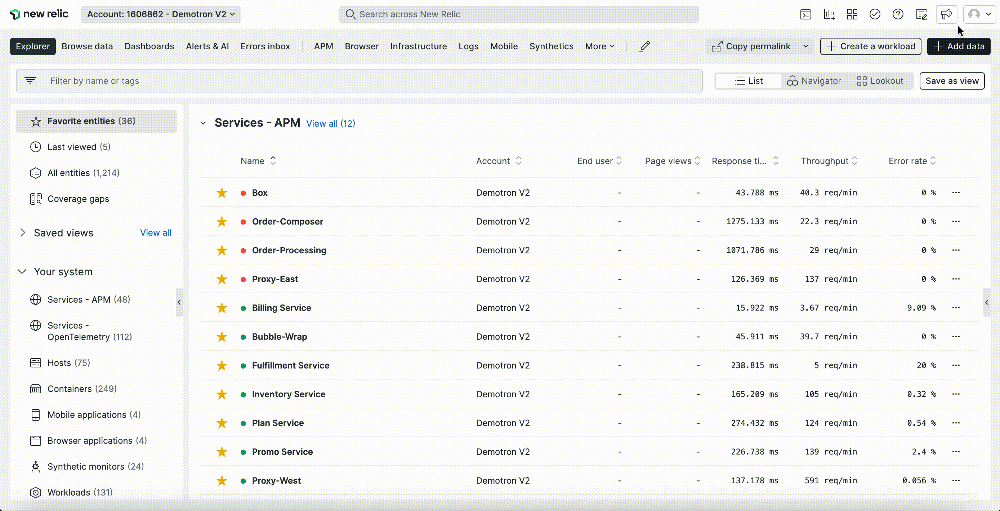

Every engineer needs intuitive and fast access to telemetry data to make informed decisions about their applications and systems. That's why we've redesigned the New Relic UI to make it simpler, faster, and more convenient so you can focus on the data that matters most.

Starting today, you can test the new UI in a public preview. To try out the new features, go to your user menu in the top right corner, and toggle **New design** to **On**.

The enhanced user interface includes:
* **Default system health-at-a-glance**: Instant visibility of all of your services in one place with throughput, response rate, and error rate under the new “All Entities” tab. 
* **Less distractions**: Declutter your workspace by collapsing the side menu to focus on what matters most. 
* **Intuitive navigation**: Get to your data faster with simple and consistent navigation across the entire platform.
* **Full customization**: Personalize your experience by pinning your most used tools and features to the nav bar. 
* **Easier instrumentation**: Immediately access hundreds of data sources, pre-built dashboards, alert configurations, and custom applications that help you monitor your stack from the “Add data” button in the nav bar. 

[Read our blog](https://newrelic.com/blog/nerdlog/new-ui-new-relic), check out our [docs page](https://docs.newrelic.com/docs/new-relic-solutions/new-relic-one/new-navigation-transition-guide), and watch the demo video below for more tips and tricks on using the new interface. 

<iframe width="560" height="315" src="https://www.youtube.com/embed/c8gxuwEFtuU" frameborder="0" allow="accelerometer; autoplay; clipboard-write; encrypted-media; gyroscope; picture-in-picture" allowfullscreen></iframe>

