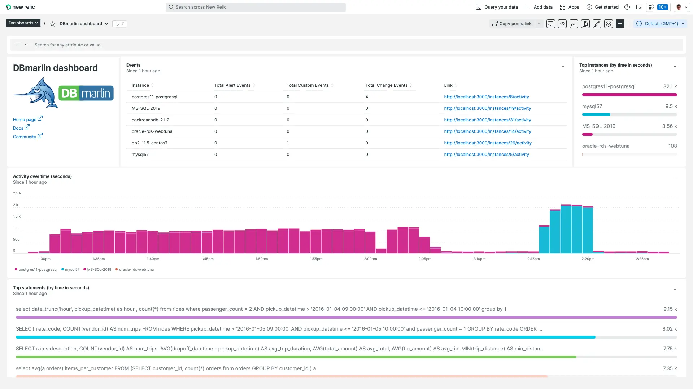

The new **DBmarlin integration and the DBmarlin quickstart dashboard** for New Relic make it easier to monitor the functionality and performance of your databases alongside the rest of your observability data. 

[DBmarlin](https://www.dbmarlin.com/) brings deep database performance and change monitoring to the New Relic platform so that developers, testers, SRE engineers as well as database administrators can understand *why* database performance is slow and *how* to improve it.

The quickstart sends database performance data, including database time, top SQL statements, and top wait events, from DBmarlin to New Relic. It also comes with a pre-built dashboard so you can see when database slowdowns occur and what is causing them.

<figcaption>Install the DBmarlin quickstart for a pre-configured dashboard to quickly monitor the performance of your databases.</figcaption>

## Benefits

* Monitor database performance, track changes, and help your databases run fast.
* Easy and consistent monitoring for CockroachDB, DB2, MariaDB, MySQL, Oracle, PostgreSQL and SQL Server, self-hosted or in the cloud. 
* See how changes to your code, user load, infrastructure, or some other event impacts performance.
* Capture SQL statement text and wait events so you can see exactly where the time is spent executing SQL within your database. 
* Auto-detect changes to schema objects, database parameters, and execution plans so you can see their impact on performance.

## Get started

You can send data to New Relic with DBmarlin v2.7 and above. This allows you to monitor database performance data within a customizable New Relic quickstart dashboard alongside the rest of your stack.

* [Install the quickstart](https://newrelic.com/instant-observability/dbmarlin/a0daa1f8-99de-41ba-b7cb-7dd87c1bf7f2).
* Claim [a free premium copy of DBmarlin](https://www.dbmarlin.com/new-relic-offer) that can be applied to any supported database.
* Before [installing the integration](https://docs.dbmarlin.com/docs/integrations/newrelic/) you'll need to install DBmarlin. If you haven't already installed DBmarlin, [see the install instructions](https://docs.dbmarlin.com/docs/Getting-Started/hardware-requirements).
* [Read the DBmarlin blog](https://www.dbmarlin.com/blog/2022-07-29-dbmarlin-v2-7-0-released) to learn more about version 2.7 of DBmarlin and the New Relic integration.
* Check out the [Explorers Hub post](https://discuss.newrelic.com/t/introducing-database-monitoring-with-the-dbmarlin-integration/189202).
