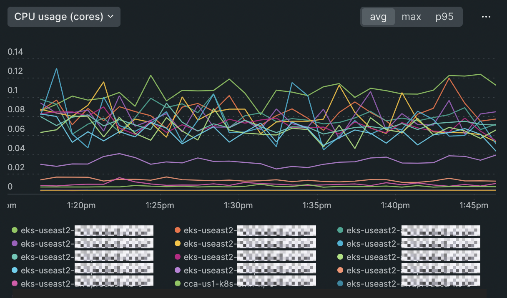

# Build performant Kubernetes workloads by understanding how multi-cluster performance impacts your apps.

1. Analyze workload performance across all your clusters in a single, curated UI.
2. Get alerted with a real-time activity stream for K8s events and critical issues.
3. Correlate performance anomalies across clusters with one-click logs and side-by-side (selectable) metrics.

# How to get started
Go to [**APM**](https://onenr.io/08dQea8qYQe), or on the left hand navigation, select **Kubernetes**. Alternatively, you may follow along manually using our [**documentation**](https://docs.newrelic.com/docs/apm/apm-ui-pages/monitoring/kubernetes-summary-page/).

Note that in order to see Kubernetes performance data in New Relic, you must meet the following prerequisites:
1. Install the New Relic [infrastructure integration](https://docs.newrelic.com/docs/kubernetes-pixie/kubernetes-integration/installation/install-kubernetes-integration-using-helm/)
2. Use [APM](https://docs.newrelic.com/docs/apm/new-relic-apm/getting-started/introduction-apm/)
3. Users must be on [**Full user** licenses](https://newrelic.com/pricing)

<figcaption>A screenshot showing CPU usage by cluster over time.</figcaption>