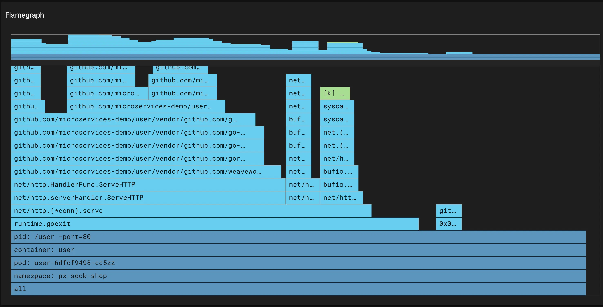

## Optimize your Java code by understanding CPU utilization using flamegraphs

1. Understand where your Java application is spending its CPU time and why CPU utilization increased with your new release.
2. Use continuously in production with a minimally-invasive, ultra low overhead (< 0.1%) profiler.
3. Avoid downtime with no need to re-deploy your application.
4. Get full system visibility, including for both Java and all other running applications.

**Note**: Pixie's continuous profiler *also* supports Go, C++, and Rust.

## How to get started

1. [Deploy Pixie](https://docs.newrelic.com/docs/kubernetes-pixie/auto-telemetry-pixie/install-auto-telemetry-pixie) in your cluster(s).
2. In the New Relic UI, select a pod listed in the Kubernetes cluster explorer view to see the pod details view.
3. From the pod details view, select the **Check flamegraph in Pixie** option.
4. Alternatively, use the px/node script in the [Live debugging with Pixie tab](https://docs.newrelic.com/docs/kubernetes-pixie/auto-telemetry-pixie/understand-use-data/live-debugging-with-pixie). Scroll to the bottom of this view to see the CPU flamegraph for the node.

Learn more and check out a deep-dive video on the [Pixie docs page](https://docs.px.dev/tutorials/pixie-101/profiler/).

<figcaption>A screenshot showing CPU utilization by function.</figcaption>
