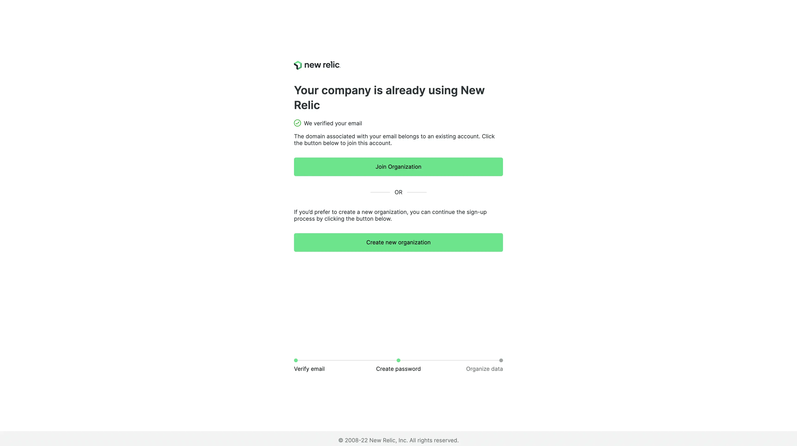

Minimize the likelihood of unintentional sign-ups for new, disconnected Standard edition New Relic organizations. As an administrator with access to [**organization settings**](https://docs.newrelic.com/docs/accounts/accounts-billing/new-relic-one-user-management/user-management-concepts/#admin-settings), you can now verify your company’s domain(s) with New Relic to enable domain capture. This feature gives new users that sign up with a verified matching email domain the option to automatically join your existing Pro or Enterprise edition New Relic organization. New users get a more straightforward sign-up flow that will grant seamless access to your company’s data and monitoring tools that you’ve already set up, which alleviates the stress of manually distributing access. In addition, this will allow for instant collaboration between the new and existing users.

<figcaption>
The new user sign-up flow after domain capture is enabled.
</figcaption>

Take a deeper dive into the key steps involved in enabling domain capture:
* **Domain name system (DNS) verification** will provide the necessary security by ensuring that the domain(s) inputted belong to the company in question. Add the TXT record provided by New Relic to your DNS records. If needed, ask your IT department for assistance with this process.
* **Configure preferences** for the new user sign up process. Determine the domain, user group, and user type that the new users will be assigned to. The user group determines the individual’s access limitations within the account.

[**Set up domain capture**](https://docs.newrelic.com/docs/accounts/accounts-billing/account-setup/domain-capture) today or learn more by checking out the [**launch blog post**](https://newrelic.com/blog/nerdlog/domain-capture).
