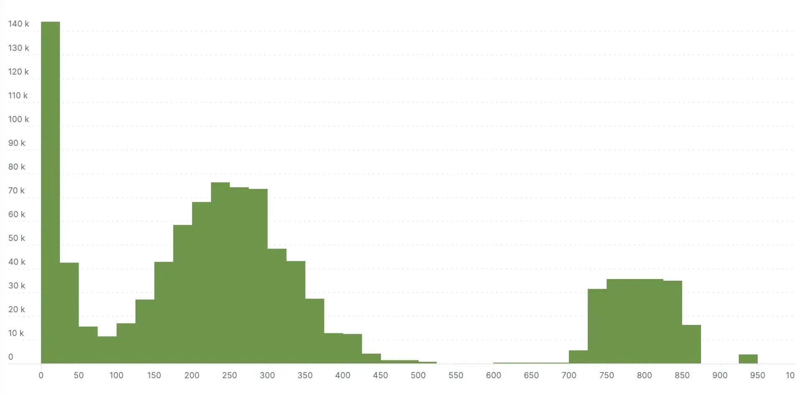

Today, we're excited to announce support for OpenTelemetry Protocol (OTLP) version [0.18.0](https://github.com/open-telemetry/opentelemetry-proto/releases/tag/v0.18.0). A number of enhancements have been introduced to the protocol since we announced [general availability](https://newrelic.com/blog/nerdlog/open-telemetry-support-ga) for OTLP version 0.10.0 a year ago.

Importantly, the logs data model was declared stable in version 0.18.0. The data models for the other signals, traces and metrics, were declared stable in prior releases. The stability of all three telemetry signals marks an important milestone for the project and better stability guarantees for users. At this time, JSON encoding has not yet been declared stable.

Another exciting enhancement available in version 0.18.0 is the addition of exponential histograms. These provide better representation for high density distributions of measurements like response times with little to no configuration required. Learn more by reading our recent blog post on [OpenTelemetry exponential histograms](https://newrelic.com/blog/best-practices/opentelemetry-histograms).

Finally, some fields have been added, changed, and removed from the protocol in this version. For the cases where fields were changed or removed, we've taken measures to provide backwards compatibility despite breaking changes. For more information and important notes on potential future breaking changes, read our documentation on [OpenTelemetry version support](/docs/more-integrations/open-source-telemetry-integrations/opentelemetry/best-practices/opentelemetry-best-practices-versions).

