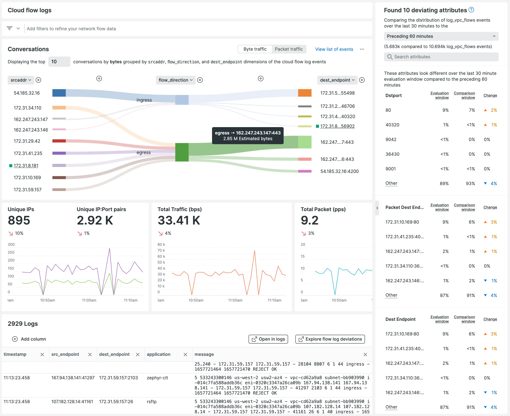
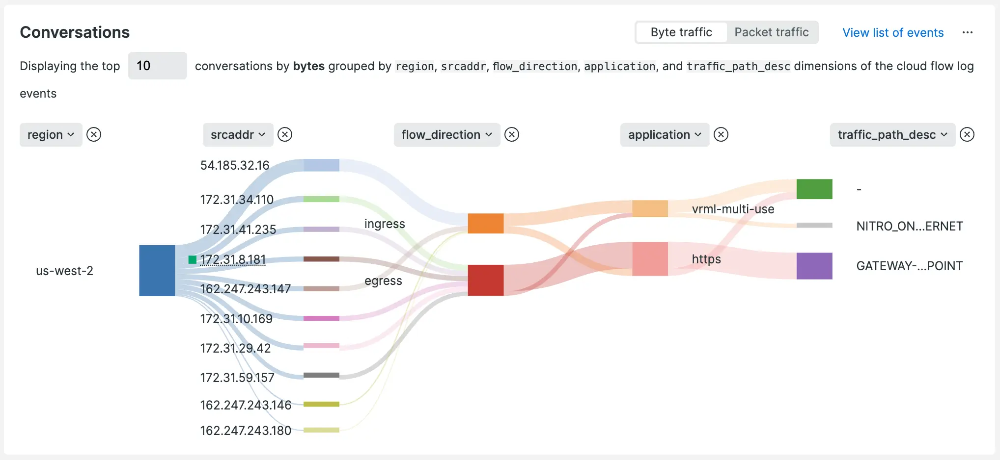

## Easier setup, faster exploration, and better insights to help you troubleshoot

With the release from Amazon Web Services (AWS), we’re announcing support for Amazon Virtual Private Cloud Flow Logs via Amazon Kinesis Data Firehose to reduce the friction of sending logs to New Relic. With VPC flow logs from across your AWS estates, you can quickly understand key insights for performance analytics and troubleshooting network connectivity.

Amazon Virtual Private Cloud (Amazon VPC) enables you to launch AWS resources into an isolated and secure virtual network with the benefits of using scalable AWS infrastructure.

With New Relic’s Amazon VPC flow log integration, you’ll be able to:

* Monitor and alert on network traffic from within your VPC in New Relic.
* Visualize network performance metrics like bytes and packets per second, as well as accepts and rejects per second across every TCP or UDP port.
* Explore flow log deviations to look for unexpected changes in network volume or health.
* Diagnose overly restrictive security group rules or potentially malicious traffic issues.

## How to configure

With a guided configuration that supports both the AWS CLI and CloudFormation, customers can quickly define the VPCs that will ship flow logs, opt to sample or send all logs, and quickly explore VPC telemetry using network performance monitoring in New Relic.

1. If you don't have one, sign up for a [free New Relic account](https://newrelic.com/signup).
2. In New Relic, click [Add data](https://one.newrelic.com/marketplace?duration=1800000&state=79e952e9-b09e-3343-2a9c-481337ff28ac) and search for `VPC flow logs`.
3. Follow the guided install process to configure your AWS environment to send VPC flow logs to New Relic using a Kinesis Data Firehose.
4. Explore your VPC flow logs using network monitoring, New Relic Explorer, New Relic Navigator, and New Relic Lookout.
5. You’ll now be able to use the curated flow logs view shown within infrastructure monitoring to answer “Is it the network?” faster.

## Next Steps

[Sign up today for a free New Relic account](https://newrelic.com/signup) to take advantage of the 100 GB/month of data ingest, one full-platform user, and unlimited basic users offering to get started with network monitoring as part of the observability journey.

Check our documentation on how to [set up AWS VPC flow log monitoring](/docs/network-performance-monitoring/setup-performance-monitoring/cloud-flow-logs/aws-vpc-flow-log-monitoring) for more details. 

