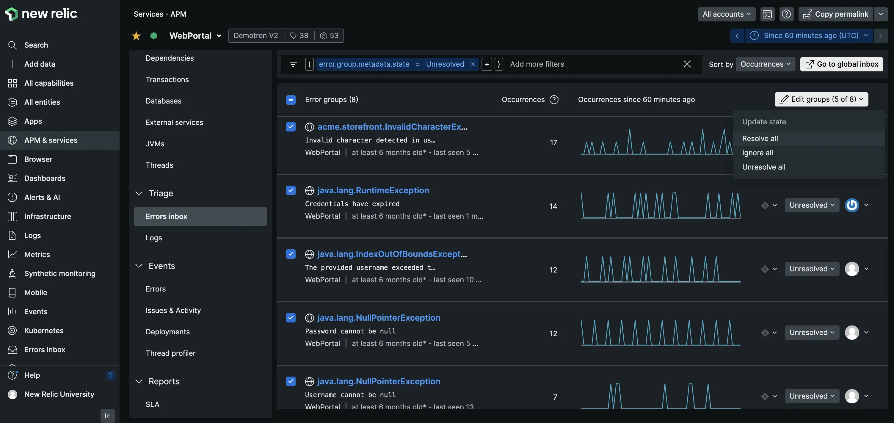

We’ve released a few errors inbox features designed to help you efficiently prioritize and organize your error groups, and help you act quickly on any errors without having to switch contexts.

These enhancements include: 
* [Regression flags for faster detection and prioritization:](https://docs.newrelic.com/docs/errors-inbox/errors-inbox/#regression-tag) Error groups that were previously resolved are auto-unresolved if a new error instance that matches an error group fingerprint is detected. Regressed error groups are valuable to identify because they generally represent a higher ROI bug since they continue to occur. 
* [Bulk actions to save time and declutter the inbox:](https://docs.newrelic.com/docs/errors-inbox/errors-inbox/#bulk-actions) You can now update the status of multiple error groups (up to 2,000) all at once. 
* [Email Notifications to foster contextual collaboration:](https://docs.newrelic.com/docs/errors-inbox/errors-email-notifications) Email notifications and any status updates are now sent via New Relic to assigned users, with detailed error information in-line. 

**How to get started**
* Check out our errors inbox [documentation](https://docs.newrelic.com/docs/errors-inbox/errors-inbox/).
* **BONUS** Watch this [Nerd Bytes](https://www.youtube.com/watch?v=v2frs2Pyjfw) video for another cool errors inbox feature: the Jira Integration. 

