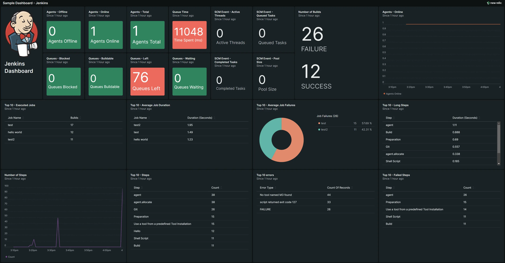

You can now monitor your Jenkins data with New Relic using the Jenkins OpenTelemetry plugin. Jenkins is a popular open-source automation tool for implementing continuous integration (CI) and continuous development (CD) workflows called pipelines. The Jenkins OpenTelemetry plugin makes it easier to get observability into your CI/CD pipeline health and performance. 

<figcaption>Install the Jenkins quickstart dashboard for a pre-built view of your key pipeline metrics. For example, you can see a summary of the number of Jenkins instances available, the number of successful jobs, the top errors, and the job queue status.</figcaption>

## Improve your jobs and builds with pipeline observability
Sending your Jenkins pipeline data to New Relic provides visibility into the building and deployment phases of the DevOps lifecycle. The Jenkins plugin gives you more insights into your DevOps practices and helps you shift left.

With the Jenkins integration and [quickstart](https://newrelic.com/instant-observability/jenkins), you can easily:
- **Understand the health of your Jenkins pipelines at a glance** with a pre-built dashboard showing key metrics about your builds, agents, queues, jobs, and more.
- **See exactly where pipelines start failing** with distributed traces, allowing you to create appropriate alerts 
- **View Jenkins console logs in context** of your pipeline build steps

## Get started
<iframe width="702" height="395" src="https://www.youtube.com/embed/ZCF75LTtdz0" title="Monitoring Jenkins with OpenTelemetry" frameborder="0" allow="accelerometer; autoplay; clipboard-write; encrypted-media; gyroscope; picture-in-picture" allowfullscreen></iframe>

To start monitoring Jenkins in New Relic:
1.  Watch the [video](https://www.youtube.com/watch?v=ZCF75LTtdz0) above for a demo walkthrough
2.  Read the [blog](https://newrelic.com/blog/how-to-relic/monitoring-jenkins-pipelines) and [documentation](https://docs.newrelic.com/docs/more-integrations/open-source-telemetry-integrations/opentelemetry/jenkins/monitoring-jenkins-ot) for set up instructions
3.  Install the [quickstart](https://newrelic.com/instant-observability/jenkins) to get the out-of-the-box Jenkins monitoring dashboard
