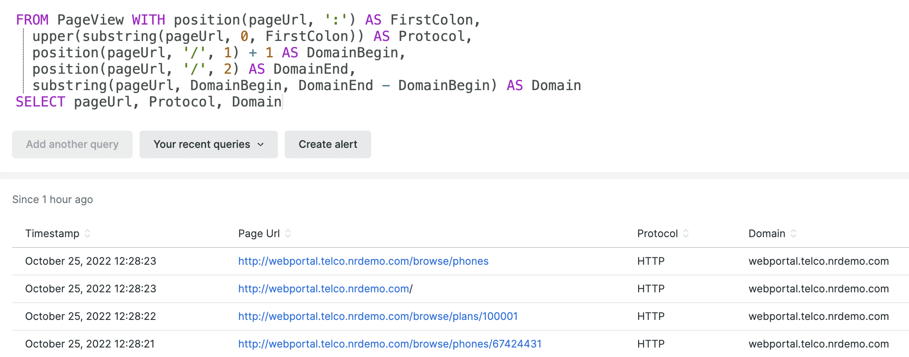

With the launch of four new NRQL functions, you can now transform string data right within your query.

## New NRQL string functions allow better formatting and easier comparisons

* `substring()` extracts part of a string
* `position()` finds the location of a substring within a string
* `lower()` changes a string to lowercase
* `upper()` changes a string to uppercase

## Combine functions to query what you need

By combining these new string functions, you can extract and format the data you want right within the NRQL query.  This can be especially powerful when combined with the recently announced [NRQL Variables](https://newrelic.com/blog/how-to-relic/nrql-improvements) feature to get your insights faster:

## Next steps

Review the docs for [substring()](https://docs.newrelic.com/docs/query-your-data/nrql-new-relic-query-language/get-started/nrql-syntax-clauses-functions/#func-substring), [position()](https://docs.newrelic.com/docs/query-your-data/nrql-new-relic-query-language/get-started/nrql-syntax-clauses-functions/#func-position), [upper()](https://docs.newrelic.com/docs/query-your-data/nrql-new-relic-query-language/get-started/nrql-syntax-clauses-functions/#func-upper), and [lower()](https://docs.newrelic.com/docs/query-your-data/nrql-new-relic-query-language/get-started/nrql-syntax-clauses-functions/#func-lower) and start working with strings in your queries!
