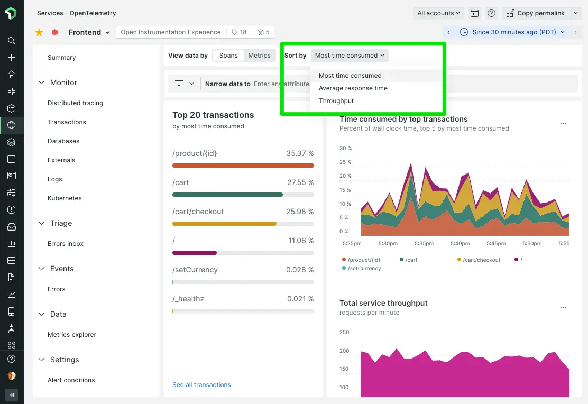
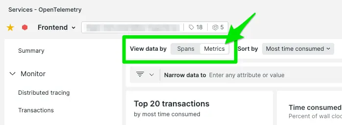

To understand how the different endpoints of a service are performing, with accurate measurements even when tracing spans are sampled, you can now use the **Transactions** view with OpenTelemetry metrics. Transactions for OpenTelemetry now offers these features:
- Choose a view of endpoint performance based on either metrics or spans
- New charts
  - Total time resources consumed by each endpoint
  - Comparison of time consumed, throughput, or average response time for top endpoints

## Sampling spans? You'll need metrics
When instrumenting your services with OpenTelemetry, you can save on telemetry cost and make it easier to find the most relevant traces by collecting only a sample of tracing spans. This is often done using head-based or tail-based sampling techniques, with the [opentelemetry-collector](https://github.com/open-telemetry/opentelemetry-specification/blob/main/specification/trace/sdk.md#built-in-samplers) by itself or in combination with New Relic's [Infinite Tracing for OTLP](https://docs.newrelic.com/docs/more-integrations/open-source-telemetry-integrations/opentelemetry/best-practices/opentelemetry-best-practices-traces#infinite-tracing).

However, sampling spans means that you need another way to get accurate aggregate measures of service performance, in particular of throughput. OpenTelemetry metrics addresses that problem, including support for histograms so that you can see response time percentiles, for example.

## Understand service performance using spans or metrics
Now you can have accurate measures of performance broken down by the endpoint or route (we call them "transactions") of your OTel-instrumented services in New Relic, as well as the trace/span data to explain why performance has changed. We've also made changes to the **Transactions** page that focus your attention on the endpoints that are consuming the most time, with options to see the slowest average transactions or the highest-throughput transactions.

To choose a view of transaction performance for your service based on metrics, just select the **Metrics** toggle at the top of the **Transactions** page.

The **Transactions** view works today with metrics only for HTTP service endpoints. For other protocols like gRPC, or if you're not yet collecting metrics from your OpenTelemetry services, you can continue to use the **Transactions** view with tracing spans.
