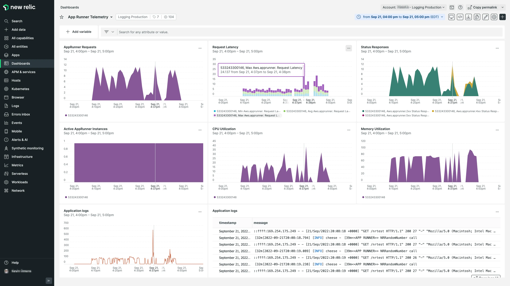

Amazon Web Services (AWS) offers AWS App Runner as a fully managed service to enable developers to quickly build and deploy containerized web applications, mobile backends, and APIs securely, at scale, and with no prior infrastructure experience required. 

New Relic now integrates with App Runner and you can use this to monitor and optimize your containerized applications, ensure they perform as expected, and validate that the App Runner service was deployed correctly. In addition, the reporting of metrics, events, and logs gives complete visibility into your containerized application.

<figcaption>Metrics and logs for AWS App Runner displayed in New Relic</figcaption>

In this example dashboard provided in the [AWS App Runner quickstart](https://newrelic.com/instant-observability/aws-apprunner) from New Relic Instant Observability, you can see the data needed to monitor the health of your App Runner deployment, including latency, traffic, errors, and utilization.

From this dashboard, you can see whether `RequestLatency` is associated with `CPUUtilization`, `MemoryUtilization`, or change in the `total number of requests`. For example, suppose you determine latency issues are associated with utilization. In that case, it's possible that your resources are under-provisioned, and that auto-scaling settings or reserved CPU units need adjusting to prevent a degraded customer experience.

Conversely, if `CPUUtilization` or `MemoryUtilization` is much lower than the threshold consistently, you may consider scaling back your provisioned resources to be more cost-effective.

Troubleshoot errors and alert on key metrics like `4xxStatusResponses` and `5xxStatusResponses` and see the error percentage along with successful `2xxStatusResponses` requests.

To begin exploring how to instrument AWS App Runner with New Relic, see [our App Runner docs](https://docs.newrelic.com/docs/infrastructure/amazon-integrations/aws-integrations-list/aws-apprunner).
