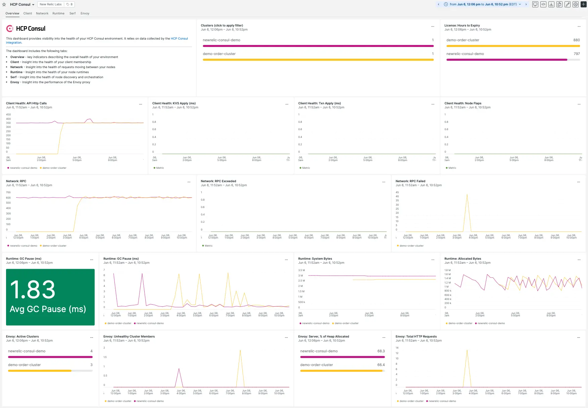

DevOps teams and app developers need visibility into their microservices and networks. This can be hard to achieve with the growing number of services and complexity of their networks. The HCP Consul integration with New Relic eliminates the blindspots while troubleshooting your service mesh data centers, providing insight into the flow and performance of your distributed systems.

## Improve HCP Consul environment health

Monitoring your cluster metrics is pivotal for keeping your mesh services operating at full capacity. Keeping your Consul clusters healthy can help with:

* Optimizing query times
* Troubleshooting slow HTTP response times
* Real-time alerting on down-time for your HCP clusters 

This integration works by installing goStatsD tooling on your HCP Consul cluster and sending metrics to New Relic for data visualization, alerting, and more. For additional details, see our [HCP Consul integration docs](https://docs.newrelic.com/docs/infrastructure/infrastructure-integrations/cloud-integrations/hcp-consul-monitoring).

## Get the quickstart dashboard

Install the [HCP Consul quickstart](https://newrelic.com/instant-observability/hcp-consul) for a pre-built dashboard that lets you see health and performance metrics for your environment, client members, network, runtime, cluster membership, and Envoy.

## About HCP Consul

HCP Consul is a service mesh and service discovery solution provided by Hashicorp. It enables platform operators to quickly deploy a fully managed, secure-by-default service mesh, helping developers discover and securely connect any application on any runtime, including Kubernetes, Nomad, and Amazon ECS.

Note: we also have an **on-host integration for HashiCorp Consul**, which is a separate integration. For more on that, see [our HashiCorp Consul monitoring integration docs](https://newrelic.com/instant-observability/consul).
