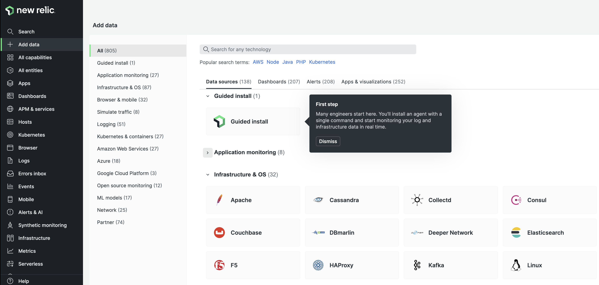
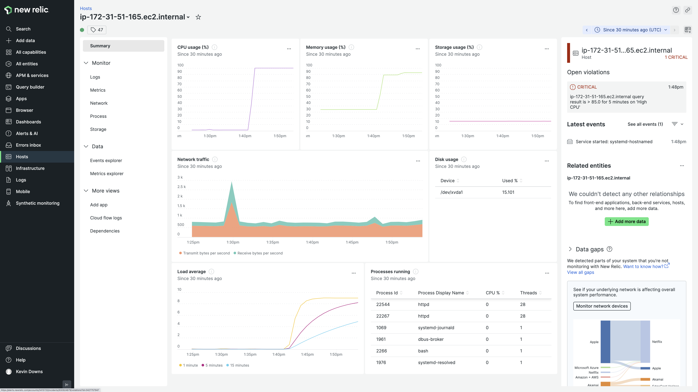

## New Relic support for Amazon Linux 2022 is generally available today

Amazon Web Services (AWS) recently released [Amazon Linux 2022](https://aws.amazon.com/linux/amazon-linux-2022/?amazon-linux-whats-new.sort-by=item.additionalFields.postDateTime&amazon-linux-whats-new.sort-order=desc) (AL2022), which is available to use with Amazon Elastic Compute Cloud (Amazon EC2), and today we're announcing support for this new modern distribution of Linux so that you can confidently monitor your applications and infrastructure just as you've done with Amazon Linux 2. Based on Fedora, AL2022 integrates with the latest AWS features, and New Relic's agents support them. In fact, the entire New Relic platform supports AL2022, including Graviton architectures, so there are no gaps for you to worry about.

When using AL2022, you can be confident that the New Relic platform offers a seamless experience to help you monitor so you can improve application and infrastructure performance. Speed up your troubleshooting workflows by incorporating Amazon EC2 service and instance metrics into your full-stack observability with New Relic.

If you're a new or existing New Relic customer monitoring AWS workloads on Amazon EC2 and want to take advantage of the updated AL2022 distribution, start by deploying the infrastructure monitoring agent and then integrate your new account with AWS.

## Guided install

Use the [guided install](https://one.newrelic.com/marketplace?state=49e6d628-79ac-7022-1689-a6a6b7673f54) to install a New Relic agent with a single command and start monitoring your infrastructure and log data in real time.

The New Relic guided install offers an enhanced instrumentation experience providing agent installation and incorporating alerts, dashboards, and logs in context.

Installing the infrastructure agent with `+Add data` and using the guided install from within the New Relic platform is the fastest way to start monitoring your instances.

Amazon Linux 2022 instance instrumented with the New Relic infrastructure monitoring agent.

## Next steps

If you haven't already integrated your New Relic account with AWS, use guided install to deploy the recommended [Amazon CloudWatch Metric Streams integration](https://newrelic.com/blog/how-to-relic/cloudwatch-metric-streams-insights). Integrating with AWS will stream Amazon CloudWatch telemetry data to your New Relic account and enhance your full-stack observability. This integration allows you to correlate the AWS services you use with your cloud-based infrastructure and applications and your end-user experience.

Next, make sure to run the [Amazon EC2 quickstart](https://newrelic.com/instant-observability/aws-ec2) to add an Amazon EC2 dashboard and `High CPU Utilization` alert.

**One last item**

Attention Amazon Linux 1 users: If you're using AL1, please update to Amazon Linux 2 or 2022, as [AWS ended standard support](https://aws.amazon.com/blogs/aws/update-on-amazon-linux-ami-end-of-life) on December 31st, 2020.
