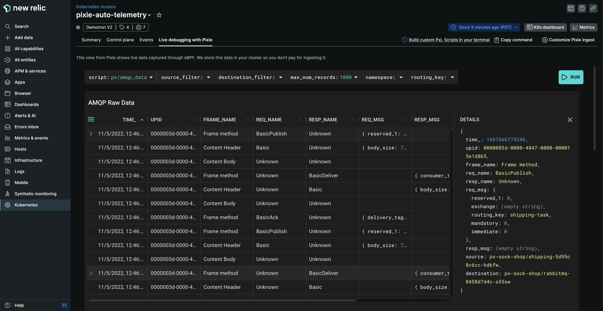

# Get automatic message tracing in Kubernetes using Pixie and eBPF.

Today we’re adding support for AMQP, giving you visibility into RabbitMQ messages. Additionally, you can now analyze Node.js applications using TLS.

When you’re troubleshooting your Kubernetes applications, you need to understand the messages being transmitted between different services. With automatic tracing, you get a service map of your entire cluster, allowing you to understand throughput, latency, and error rates across your services. This includes the ability to parse payloads, with full body request and response, and identifying full database queries.

Under the hood, we use [Pixie and eBPF](https://docs.px.dev/about-pixie/pixie-ebpf) to automatically collect fine-grained telemetry data, including service-level metrics, unsampled requests, and more. With one install command, you get deeper insight into your Kubernetes clusters and workloads. No language agents required!

# We support the following protocols:
- HTTP
- gRPC
- MySQL
- PostgreSQL
- Kafka
- Redis
- Cassandra
- DNS
- AMQP (**New**)
- NATS

For tracing messages over TLS/SSL, we support the following libraries:
- OpenSSL 1.1.0 or 1.1.1 (includes Node.js, which uses OpenSSL differently than other applications).
- Golang TLS (crypto/tls).

# How to get started
1. Install [Pixie](https://docs.newrelic.com/docs/kubernetes-pixie/auto-telemetry-pixie/install-auto-telemetry-pixie)
2. Open the [**Live debugging with Pixie**](https://docs.newrelic.com/docs/kubernetes-pixie/auto-telemetry-pixie/understand-use-data/live-debugging-with-pixie) tab to explore your telemetry data.

Watch this [**overview video**](https://www.youtube.com/watch?v=YKwjXLNXdt4) to learn more.

<figcaption>A screenshot showing AMQP messages.</figcaption>
