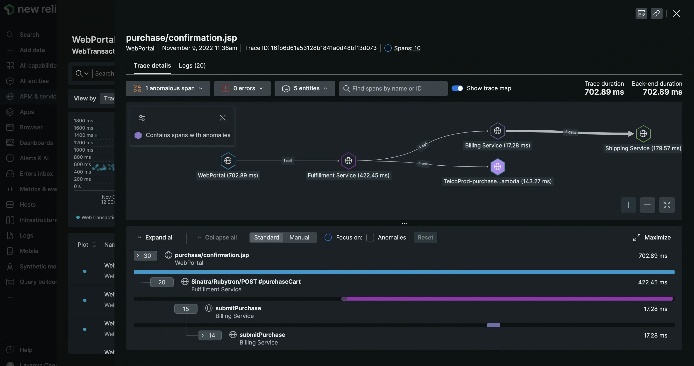

The latest version of agents provides you improved monitoring capabilities to analyze the performance of your systems. Here are some of the key features that you could be missing out on if you don’t upgrade:

* **Decode system complexity with distributed tracing:** With distributed tracing enabled by default in the latest agents, you can see all your service dependencies and quickly drill down into individual requests and errors to find the root cause of issues.
* **Troubleshoot faster with logs in context:** With the latest agents, you can minimize context switching and troubleshoot issues faster by accessing logs inside the APM UI alongside other relevant telemetry data.
* **Access production telemetry data in your IDE with Codestream:** See all telemetry data associated with specific lines of code with Codestream that is available by default in the latest agents. Also, you can discuss code, track issues, review pull requests, and jump from errors inbox directly to the relevant code in your IDE.
* **Record and monitor critical events:** With the latest agents, you can send up to three times more custom events to record and track critical actions for analysis and troubleshooting.

