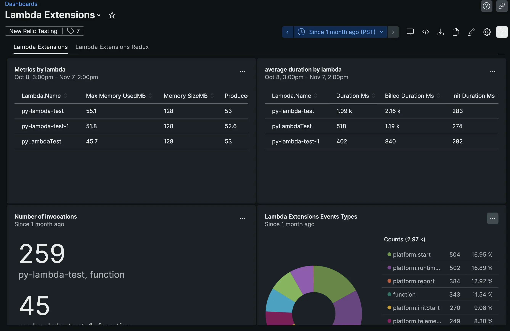

In the past, Amazon Web Services (AWS) enabled third-party tools like New Relic to ingest AWS Lambda logs directly from Lambda. AWS has now extended this functionality to all telemetry data types, including metrics, events, and traces. This enables us to deliver enhanced observability of Lambda function execution through a new Lambda Extension.

The Lambda telemetry API is an enhancement to the logs API. It makes it simpler for the New Relic extension to receive telemetry about Lambda function invocation, such as runtime, tags, max memory, and timeout. Customers can use this API to receive telemetry streams from the Lambda service, including function and extension logs, traces, and metrics coming from the Lambda platform.

The New Relic extension subscribes to the telemetry streams directly from within the Lambda execution environment, allowing an in-depth understanding of the Lambda function and extension.

Telemetry API allows extensions to subscribe to three different telemetry streams:

* Function logs: Custom logs that Lambda function code generates (`stdout`/`stderr`)
* Extension logs: Lambda extension code generates custom logs to `stdout` and `stderr`
* Platform telemetry: Metrics, events and traces which describe events and errors related to execution environment runtime lifecycle, extension lifecycle, and function invocations.

Telemetry API enables extensions to receive traces about the events related to Lambda execution environment lifecycle, with trace spans compatible with the OpenTelemetry format. Trace segments can be enriched by additional metadata for easier contextualization and diagnosis. Pairing this trace data with log data, you can rapidly troubleshoot performance problems, outages, and errors.

