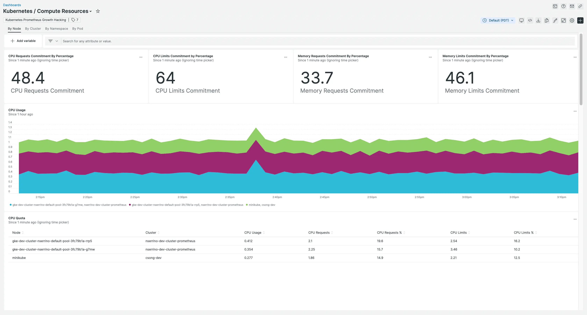

We’ve made it easier to understand the performance of your Kubernetes clusters and cluster services with our new Prometheus solution. Now you can analyze your Kubernetes clusters using prebuilt dashboards and alerts, correlate Prometheus metrics alongside the rest of your observability data in one place, and take advantage of effortless, enterprise-grade Prometheus monitoring. So you can focus your energy on Kubernetes performance instead of building and scaling monitoring solutions.

Our Prometheus solution can be broken down into two components–the **data layer** and the **analysis layer**–and we’ve made big updates to both.

# **Data layer**: Get a centralized, long-term data store for your Prometheus metrics.
- **Scale and performance**: Get horizontal scaling via agent sharding using [Prometheus agent mode](https://prometheus.io/blog/2021/11/16/agent/).
- **Start easily**: Automatically collect cluster performance metrics, and metrics from 20+ services such as Istio, CoreDNS, NGINX, Redis, etcd, Calico, and more.
- **Federation**: Combine data from all of your Prometheus servers in one place.
- **Minimize local storage**: Get 13 months of retention with New Relic, and dial down your local resources.

# **Analysis layer**: Observe all your telemetry data in one place.
- **Unified analysis**: Get one place to analyze, collaborate, and alert on all your Prometheus data, right alongside the rest of your telemetry data, so you can eliminate data silos.
- **Simplified analysis**: Use pre-built dashboards and alerting policies to analyze your clusters and related services, eliminating manual setup.
- **Lightning fast**: Execute queries at scale, powered by New Relic’s enterprise-grade, SaaS platform.

# Get started today
1. Deploy New Relic’s [**new Prometheus agent**](https://docs.newrelic.com/docs/infrastructure/prometheus-integrations/install-configure-prometheus-agent/install-prometheus-agent/).
2. Analyze cluster performance using our [**new dashboard**](https://newrelic.com/instant-observability/kubernetes-prometheus).
3. Deploy [**Quickstarts**](https://newrelic.com/instant-observability/?search=prometheus) with preconfigured dashboards and alerting policies for cluster services, such as NGINX, Redis, etcd, and more.

<figcaption>A screenshot showing cluster metrics.</figcaption>
