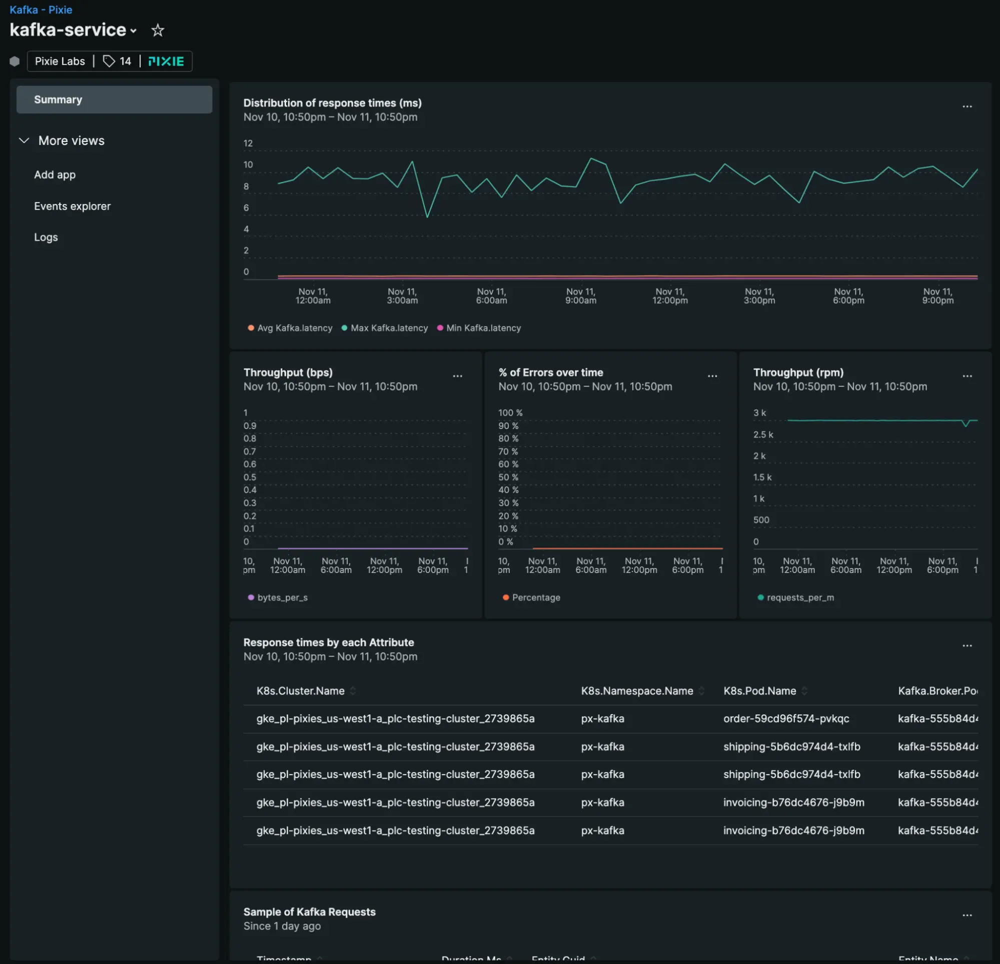

Starting today, New Relic automatically detects and exports sampled and aggregated data from Pixie for long-term retention from various technologies, including Kafka, DNS, MySQL, RabbitMQ, PostgresQL, and Redis. 

If you are using Pixie with New Relic with either the Kubernetes integration v2.0.0+ or the Pixie-New Relic Plugin v1.4.2+, no need to do anything else! You should already see entities from your environment directly in your New Relic environment.

If you aren’t using Pixie with New Relic yet, get started easily by installing the Kubernetes + Pixie integration using [the guided installation path](https://docs.newrelic.com/docs/kubernetes-pixie/kubernetes-integration/installation/kubernetes-integration-install-configure).

Learn more about [how to configure Pixie Ingest](https://docs.newrelic.com/docs/kubernetes-pixie/auto-telemetry-pixie/understand-use-data/overview#pixie-configure-storage).

