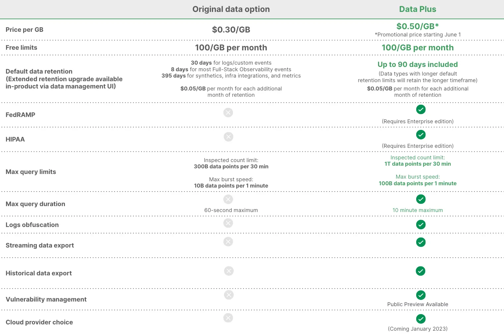

## Extending data retention and upgrading to Data Plus has become simpler

For New Relic organizations meeting certain [requirements](https://docs.newrelic.com/docs/data-apis/manage-data/manage-data-retention#requirements), we've made it easy to extend your data retention directly in-product, giving you the controls to decide how long you need your data for compliance or performing long-term analysis. Extended retention only costs $0.05/GB per month, giving you the ability to conduct historical analysis to get deeper insights than you could with standard retention. [Learn more about data retention for specific data types.](https://docs.newrelic.com/docs/data-apis/manage-data/manage-data-retention/#retention-periods)

Also included in this release is the ability to upgrade to [Data Plus](https://docs.newrelic.com/docs/accounts/accounts-billing/new-relic-one-pricing-billing/data-ingest-billing/#data-plus) in-product, which includes 90 days of extended retention plus and so much more (see, that's why we call it "Plus"). Data Plus also gives you up to 3x the maximum limit on number of queries and 10x the maximum query duration, streaming and historical data export, logs obfuscation, and HIPAA and FEDRamp compliance, with more enterprise-grade capabilities coming soon.

Note that this self-serve ability is only available to some organizations. 

## How to get started

1. Extend data retention or upgrade to Data Plus from the [data management hub](https://one.newrelic.com/data-management-hub). (Note that [this feature isn't available to all organizations](https://docs.newrelic.com/docs/data-apis/manage-data/manage-data-retention#requirements).)
2. Learn more about [data retention](https://docs.newrelic.com/docs/data-apis/manage-data/manage-data-retention/#retention-periods).
3. If you have further questions, reach out to your account team or check out our [pricing page](https://newrelic.com/pricing).

