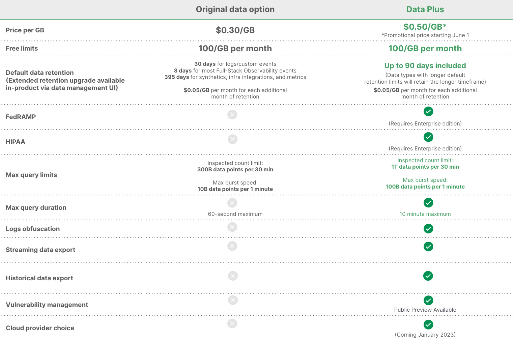

## Overview

We've made it easy to extend your data retention directly in-product, giving you the controls to decide how long you need your data for compliance or performing long-term analysis. Extended retention only costs $0.05/GB per a month, giving you the ability to conduct historical analysis to get deeper insights than you could with standard retention. Learn more about data retention for specific data types here.

Also included in this release is the ability to upgrade to [Data Plus](https://newrelic.com/blog/nerdlog/data-plus-pricing) in-product, which includes 90 days of extended retention plus so much more (see, that's why we call it "Plus"). Data Plus also gives you up to 3x the maximum query limit and 10x the maximum duration per query, streaming and historical data export, logs obfuscation, and HIPAA and FEDRamp compliance, with more enterprise-grade capabilities coming soon.

## How to get started

1. Extend data retention or upgrade to Data Plus on your [data management screen](https://one.newrelic.com/data-management-hub).

2. Learn more about [data retention](https://docs.newrelic.com/docs/data-apis/manage-data/manage-data-retention/#retention-periods).

3. If you have further questions, reach out to your account team or check out our [pricing page](https://newrelic.com/pricing).

