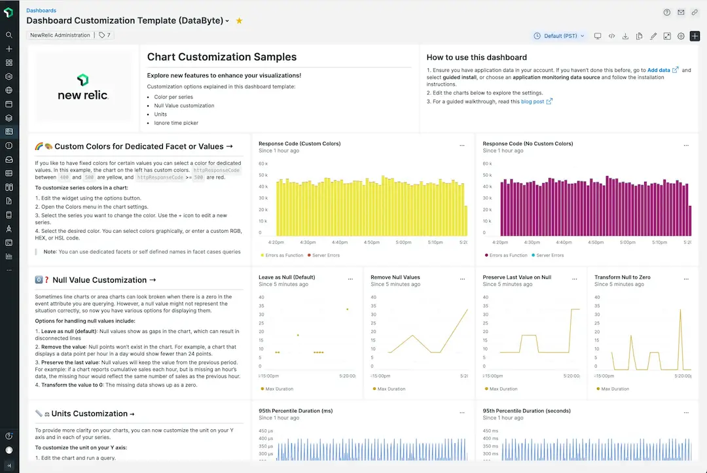

# New chart customization options
New Relic dashboards let you analyze telemetry data across your entire stack, regardless of the source. Dashboards are a flexible way for engineering teams to visualize data however they want by combining pre-made templates, native platform visualizations, custom queries, and more—all in one place.

Now there are more ways to upgrade your dashboards, including:
- **Markdown widget:** Add rich custom content to your dashboards such as links, checklists, tables, and text formatting.
- **Custom colors:** Highlight key information or choose a preferred color palette for each data series.
- **Null value options:** Four options to display, transform, or remove null points.
- **Unit labels:** Increase chart detail and clarity with custom units per series.
- **Override time picker:** Analyze different time ranges in a single dashboard.

## See it in action
Check out the video below to see an interactive demo:
<iframe width="702" height="395" src="https://www.youtube.com/embed/LA2jM_asl94" title="New Chart Customization Features (Interactive Demo)" frameborder="0" allow="accelerometer; autoplay; clipboard-write; encrypted-media; gyroscope; picture-in-picture" allowfullscreen></iframe>

See some use cases and how to make the most of the Markdown widget:
<iframe width="702" height="395" src="https://www.youtube.com/embed/_dLwy7xskBk" title="Enhance your New Relic dashboards with Markdown" frameborder="0" allow="accelerometer; autoplay; clipboard-write; encrypted-media; gyroscope; picture-in-picture" allowfullscreen></iframe>

## Try it yourself with the template dashboard

<figcaption>Import the sample dashboard to test out the new customization options.</figcaption>

You can explore the customization options by following the steps in this [hands-on blog](https://newrelic.com/blog/how-to-relic/dashboard-chart-customizations). It shows shows you how to import the pre-made template dashboard, describes each option, and demonstrates how to use them in your own charts.
