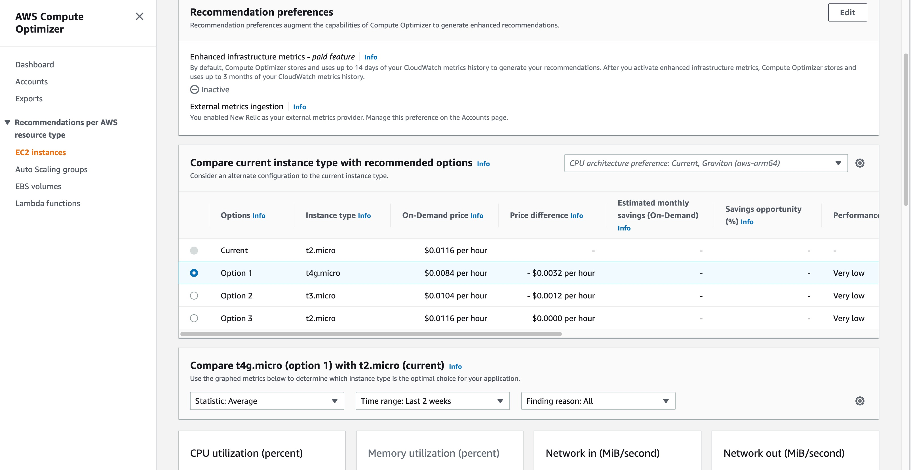
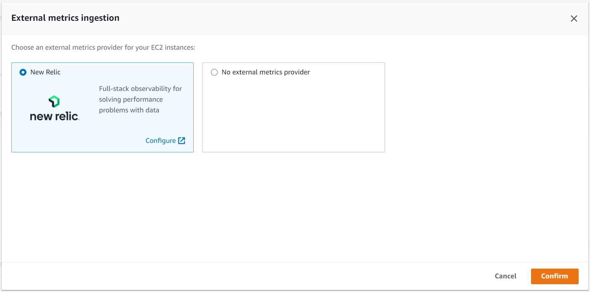

## AWS Compute Optimizer integration

New Relic is pleased to partner with AWS to allow joint customers on our Data Plus plan to feed memory utilization data to AWS’ Compute Optimizer engine, at no additional cost. According to AWS, “when memory metrics are present in Compute Optimizer, the total savings potential of the recommendations can be many times higher than without them”.

AWS Compute Optimizer Recommendations

To prepare for this integration, be sure to first deploy the New Relic Infrastructure Agent to any EC2 instances in AWS that you want to monitor. Instructions for using AWS System Manager Distributor to easily do so can be found [here](https://docs.newrelic.com/docs/infrastructure/amazon-integrations/aws-integrations-list/aws-sys-dist).

To enable this integration, first select New Relic as your third party provider in AWS Compute Optimizer.

Third-party Metrics Selector

Once this is done, send a request for AWS Compute Optimizer to your New Relic sales team. They will open a support ticket to turn this integration on. Once you are notified that the integration has been enabled, it will take up to 30 hours of data flowing for the recommendations to reflect the memory utilization metrics.

AWS will always ensure no rightsizing recommendations risk harming application performance. However, without this integration their lack of memory metrics will limit the cost savings potential. Unlock the full potential of rightsizing your EC2 environment with AWS Compute Optimizer powered by New Relic memory metrics.