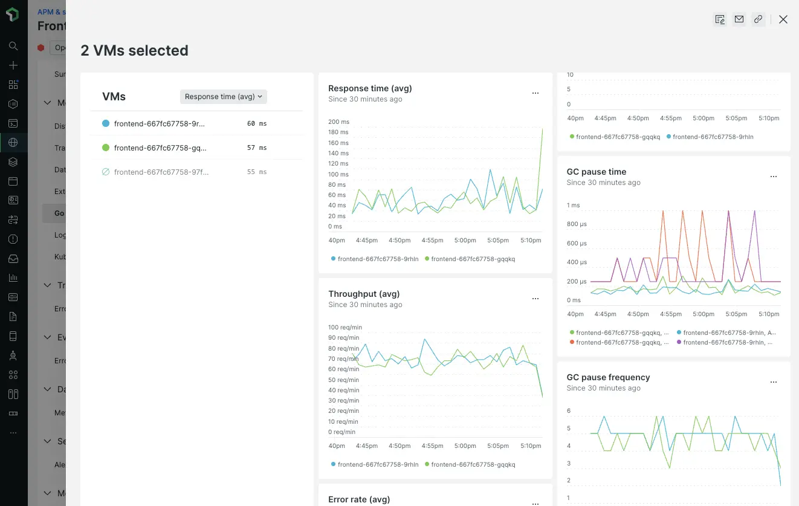

A new **Go runtime** page for services instrumented with OpenTelemetry allows you to identify service instances with unusual or unhealthy performance patterns. You can compare the key service health and Go runtime metrics over time, across any number of instances.

With this data, you can:

  * Determine whether garbage collection (GOGC) or memory settings should be tuned for a better fit to the actual load
  * Identify instances receiving an unbalanced amount of traffic
  * Spot slow memory leaks or goroutine leaks

The new Go runtime page is based on summaries of key metrics: response time, throughput, error rate, garbage collection time, and memory usage. You can use these key metrics to compare several service instances. You can also compare all those instances' Go runtime metrics collected by OpenTelemetry instrumentation using timeseries charts to spot problems.

The New Relic Go runtime page is available today for OpenTelemetry services instrumented with the `runtime` package from [opentelemetry-go-contrib](https://github.com/open-telemetry/opentelemetry-go-contrib/tree/main/instrumentation), version 1.4.0 or later.
