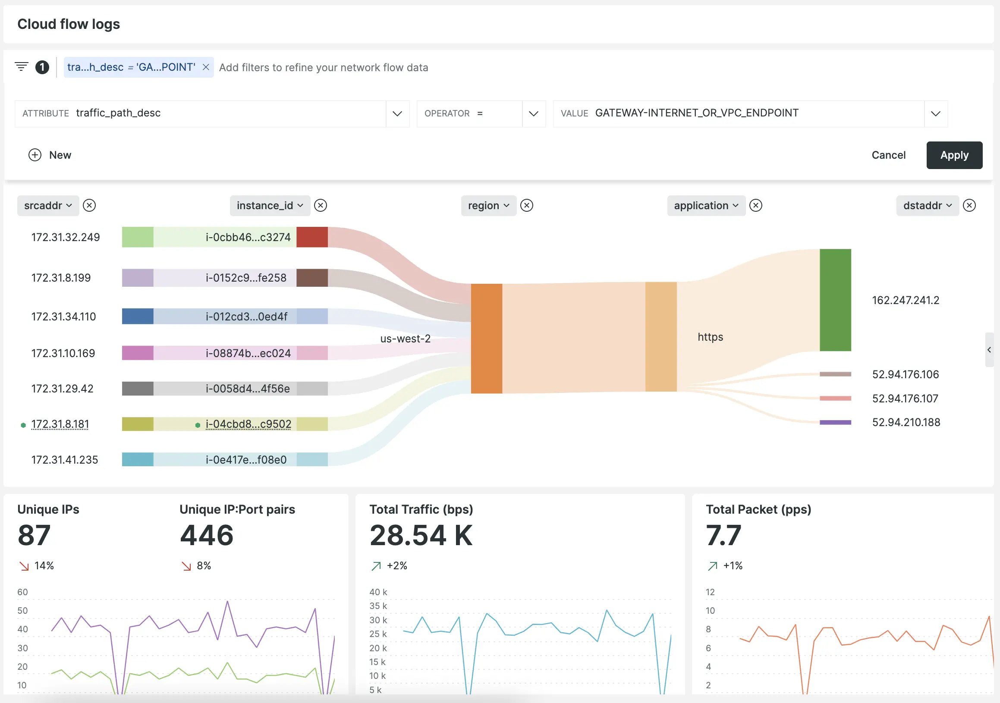

## We’re expanding our network monitoring cloud flow logs integration to support Google Cloud Platform Virutal Private Cloud flow logs

We’re making it easier to understand your virtual private cloud (VPC) networks by adding support for GCP VPC flow log data. With VPC flow logs running across your GCP estates, you can quickly understand key insights for performance analytics and troubleshooting network connectivity. 

Google VPC enables you to launch resources into an isolated and secure virtual network with the benefits of using GCP scaling infrastructure. 

By using our network monitoring solution to monitor VPC flow logs from across your GCP environments, you can:

1. Monitor and alert on network traffic from within your VPC in New Relic. 
2. Visualize network performance metrics like bytes and packets per second, as well as accepts and rejects per second across every TCP or UDP port.
3. Explore flow log deviations to look for unexpected changes in network volume or health.
4. Diagnose overly restrictive security group rules or potentially malicious traffic issues

Start monitoring your GCP Cloud Flow Logs [here](https://one.newrelic.com/marketplace?account=1606862&state=5d7bff4d-3d87-db8c-0e34-3aaf1094ee7e)

## How to get started

1. [Learn more](https://docs.newrelic.com/docs/network-performance-monitoring/setup-performance-monitoring/cloud-flow-logs/gcp-vpc-flow-log-monitoring/) about setting up GCP VPC Flow Logs in New Relic.

2. [Sign up today for a free New Relic account](https://newrelic.com/signup) to take advantage of the 100 GB/month of data ingest, one full-platform user, and unlimited basic users offering to get started with network monitoring as part of the observability journey.
