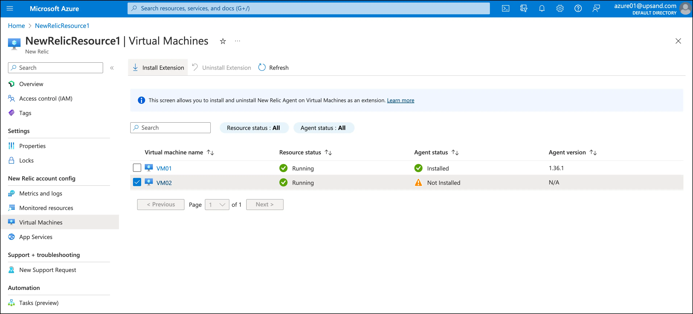
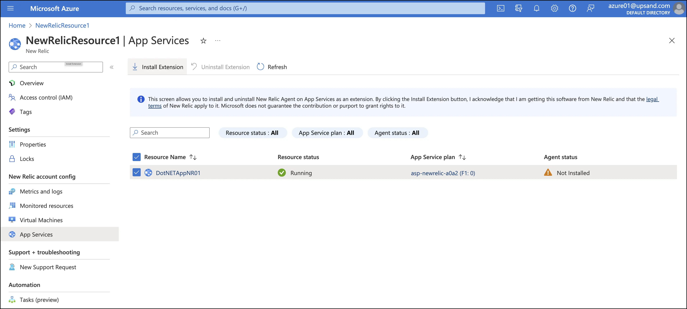

We’re announcing the availability of the Azure Native New Relic Service in the [Microsoft Azure Marketplace](https://azuremarketplace.microsoft.com/en-us/marketplace/apps/newrelicinc1635200720692.newrelic_liftr_payg?tab=Overview&exp=ubp8) to help accelerate cloud migration and multi-cloud initiatives. Microsoft Azure customers can now subscribe to the New Relic service to collect telemetry data for applications and infrastructure and store that telemetry data in Azure. In addition, Azure customers can allocate their multi-year committed Azure spend to leverage New Relic, making it significantly easier to allocate budget for all-in-one observability.

New Relic helps you accelerate your cloud adoption and multi-cloud journeys by providing a comprehensive view of the entire application stack, including the underlying cloud infrastructure, application code, and user experience, so you can quickly identify and troubleshoot performance issues, optimize multi-cloud resources, and ensure that your applications are running smoothly.

## A note for current New Relic customers

The **Azure Native New Relic Service** is a self-service Data Plus offering for new New Relic accounts only. If you would like to check it out, please head over to the Azure Marketplace and sign up for a new account.

If you are interested in starting in Azure, please contact your New Relic account team. Existing New Relic accounts can sign up for a private offer after March 31st, 2023. Azure Marketplace Private offers are scheduled to be available after March 31st. Private offers allow New Relic to offer custom prices, terms, conditions, and pricing.

## Store your telemetry in Azure

Your cloud choice matters. Now, with New Relic built on Azure, you can store telemetry data on your preferred cloud.

We designed a cell-based platform on Azure that leverages the New Relic service, which is also based on Azure, to meet our customers' highest demands for scalable, cloud-based performance.

With this integration, DevOps teams can get started fast with Azure integrations and agents, all from the New Relic platform. You can monitor all your workloads so you can debug, measure, and improve your entire stack.

## Rapid onboarding in Azure Portal 

Get to observability in under three minutes.

We’ve optimized our solution to now accelerate your Microsoft Azure observability, so you can manage the New Relic integration for Microsoft Azure directly in the Azure Portal. In addition, install infrastructure monitoring, .NET and Java APM agents, and select resources to be monitored from the Azure Portal.

Watch this Data Bytes video to learn how to onboard: 

<iframe width="560" height="315" src="https://www.youtube.com/embed/48LHdqOMAsQ" title="YouTube video player" frameborder="0" allow="accelerometer; autoplay; clipboard-write; encrypted-media; gyroscope; picture-in-picture" allowfullscreen></iframe>

For more specific configurations, see [our docs](https://docs.newrelic.com/docs/infrastructure/microsoft-azure-integrations/get-started/azure-native).

## Install New Relic agents easily from the Azure Portal

After you’ve set up the New Relic integration, you’ll need to deploy our infrastructure and APM agents to get a fuller view of your stack, and we’ve made it easy to do so right from the Azure Portal. 

Install the New Relic infrastructure monitoring agent from the Azure Portal

Install a New Relic APM agent from the Azure Portal

## Pay with Azure MACC Credits

Microsoft Azure Consumption Commitment (MACC) is a commitment to spend a certain amount on Microsoft Azure services within a specific timeframe. By subscribing to the **Azure Native New Relic Service** through the Azure Marketplace, you can apply New Relic spend to retire your MACC.

Your New Relic billing will be consolidated with your Microsoft Azure spending and available through your Microsoft Azure account. By consolidating both bills, you can easily track and manage your Microsoft Azure and New Relic spend in one place, making it easier to budget and plan for future expenses.

## Next steps

To get started with the Azure Native New Relic Service, view our [New Relic listing in the Azure Marketplace](https://azuremarketplace.microsoft.com/en-us/marketplace/apps/newrelicinc1635200720692.newrelic_liftr_payg?exp=ubp8). Or, you can go to the Azure Portal and search for New Relic in the Azure Marketplace. By subscribing to the service, you’ll automatically set up a New Relic organization with Data Plus. 

For more about what's included with Data Plus for Azure Native New Relic subscribers, see [our Data Plus docs](https://docs.newrelic.com/docs/accounts/accounts-billing/new-relic-one-pricing-billing/data-ingest-billing/#data-plus). Note: Not all Data Plus features are available for Azure subscriptions.

We’d love for you to check out this integration and tell us what you think by providing feedback in **Help > Give us feedback**.
