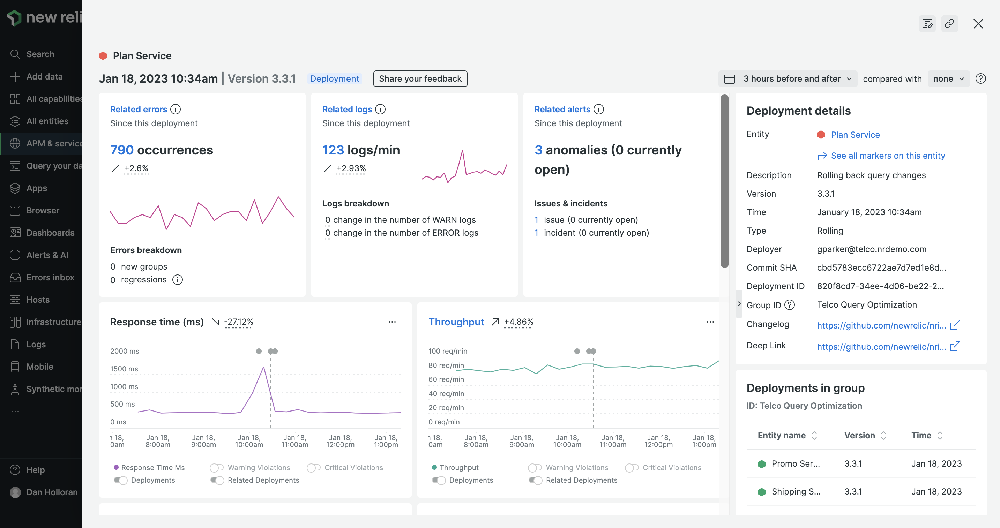

We’re excited to announce that change tracking is now generally available to all customers! We’ve made it easy to understand how changes to your system, such as code deployments, configuration changes, and business events, impact application and service performance.

## Get full stack deployment and event context with change tracking

Change tracking allows you to directly tie the performance of your software to recent changes from interfaces across New Relic. In APM, Mobile, Browser, Service Levels, Alerts, and custom dashboards (and more soon), you can see how deployments and other change events relate to shifts in golden signals, errors, log attributes, incidents, and more.

You can make these insights actionable with change event details such as commit SHAs, deep links, group IDs, CI/CD metadata, timestamps, descriptions, version numbers, links to changelogs and more. Change tracking helps you access this wealth of information and see your best next steps without losing context&mdash;simply click on a deployment marker or run a quick query.

Change tracking gives you the following capabilities:

* See and analyze changes and their effects in APM, browser, mobile, service levels, custom dashboards, and more.
* Automatically record deployments on any part of your system using a brand new flexible GraphQL API and  query deployment data alongside metrics and telemetry.
* Use fresh new UIs to quickly understand the impact of changes, why they were made, who made them, and whether they are at the root of a problem.
* Leverage a growing list of plugins and integrations with tools like Jenkins, GitHub, CircleCI, and JFrog to automate change tracking throughout your CI/CD processes.
* Contextualize your changes with rich data and insights like deep links, commit SHAs, related entities, golden signal deltas, errors, logs, anomalies and more.
* Track performance and uptime over time with flexible before/after analysis, and compare markers head-to-head to identify best practices.

## How to get started

1. Learn how to use change tracking by reading the [**docs**](https://docs.newrelic.com/docs/change-tracking/change-tracking-introduction/).
2. Log in to [New Relic](https://newrelic.com/).
3. Navigate to APM, browser, mobile, service levels, or any custom dashboard.
4. Apply markers to charts and access the change analysis details page by either clicking on a marker or navigating to **[one.newrelic.com](https://one.newrelic.com/) > APM & services > Events > Deployments *New*** in the left-hand navigation menu.

If you’d like to automatically mark any kind of custom change event across your performance charts, [sign up](https://newrelic.com/signup) to discover the new interface and the new GraphQL API for yourself.

If you don’t have a New Relic account already, [sign up for a free New Relic account](https://newrelic.com/signup) today. Your free account includes 100 GB/month of free data ingest, one free full-access user, and unlimited free basic users.