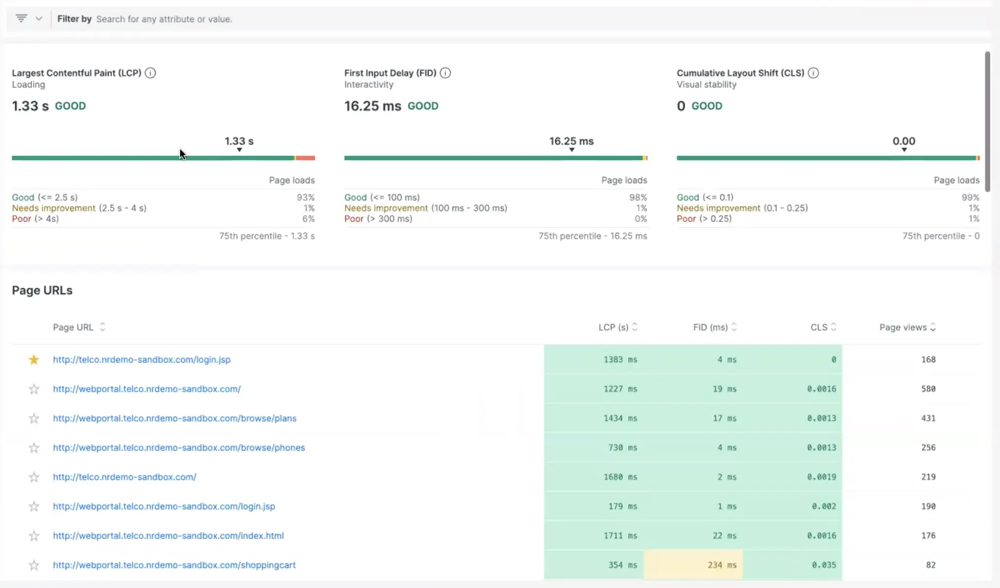
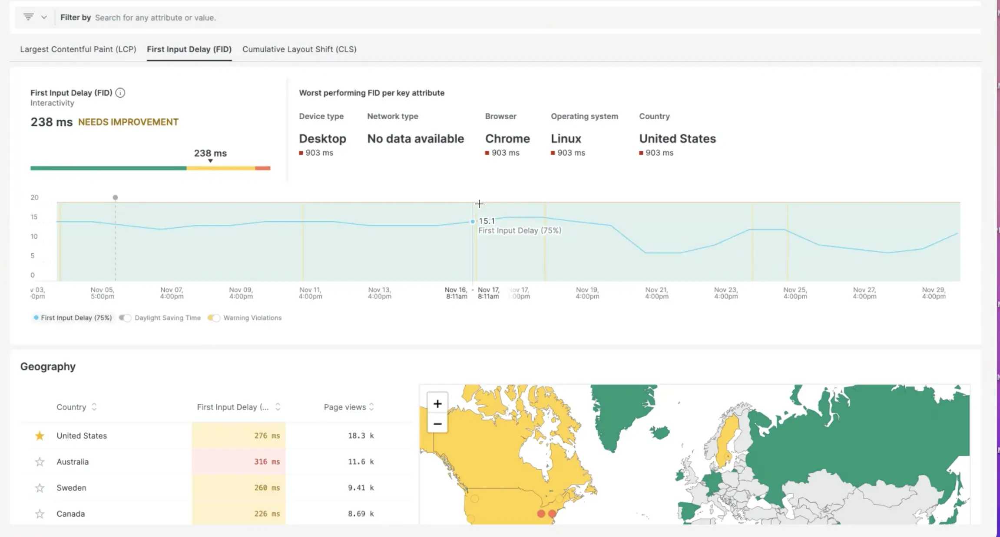
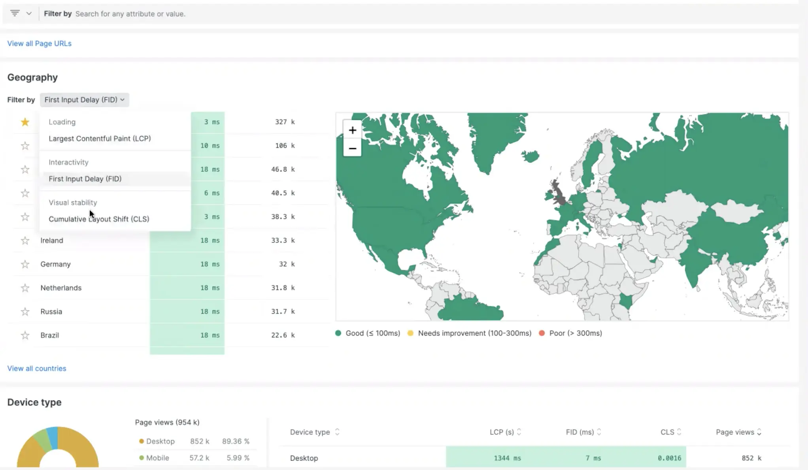

The new Web Vitals happy path in our browser monitoring experience exposes the best and worst performing pages, providing web developers with visibility into impacted users and minimizing MTTD during outages. You can favorite pages and drill into details on the best and worst performing sites, scoped down by the web vital you want to filter by.

Your engineers can look at the pages that are getting the most throughput and traffic and prioritize fixing those first, as well as favorite them for the future. There are also updates to existing Web Vital functionality such as the Geography graphic and Device Type charts.

For example, if you know that your end user base is coming specifically from two or three regions, you can favorite those regions, so that each time you log in you can just view what you care about where most of your users are coming from.

Read more about New Relic’s browser monitoring capabilities [here](https://newrelic.com/platform/browser-monitoring).