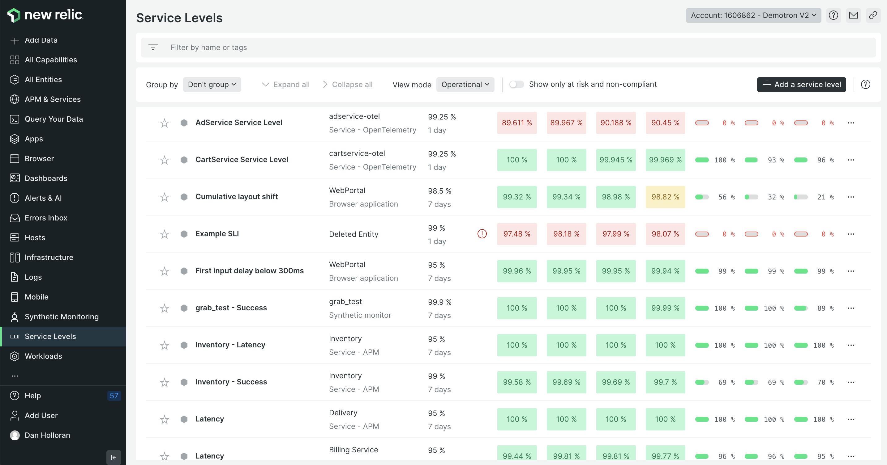

Now you can automatically determine alert thresholds and set up alerts for error budgets and fast burn rates! Service level management is a way for you to determine service boundaries and track your most critical applications and services in one place.  

If you’re unfamiliar with alerting on error budgets and burn rates, check out [the documentation](https://docs.newrelic.com/docs/service-level-management/alerts-slm/) to learn more.

**How this helps you:**
1. You can automatically determine alert thresholds for SLIs and SLOs.
2. Set pre-configured alerts for fast burn rates, error budgets, and SLI attainment based on Google’s SRE book recommendations.
3. Connect service levels to alert workflows quickly with just a few clicks.
4. Roll up multiple service levels into a workload to track the health status of multiple entities all together.
5. Use the high-level period-over-period view in the service levels UI for managers to understand the reliability of your systems over time.

**How to get started:**
* Log into New Relic and click on *All Capabilities* at the top of the left-hand navigation menu. 
* Click on the *Service Levels* item on this page to access the interface.
* On the service levels page, you’ll see existing service levels and can set up new ones.
* Once you’ve set your SLOs, click into a service level to access the details interface.
* In the upper right corner of the details interface, click the *Alert* button and follow the guided setup to configure an alert for that SLO.
* Read our [service level alerting documentation](https://docs.newrelic.com/docs/service-level-management/alerts-slm/) for further guidance around best practices for SLI and SLO alerts.

You can learn more about these capabilities and how you can implement service level management by reading our [service level management documentation](https://docs.newrelic.com/docs/service-level-management/intro-slm/) and by checking out the [use case implementation guide](https://docs.newrelic.com/docs/new-relic-solutions/observability-maturity/uptime-performance-reliability/optimize-slm-guide/).