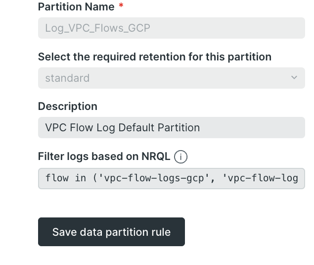

If your systems generate a massive amount of logs, than you probably already know and love the data partitioning capability in our logging product. By setting up simple  rules, it is possible to segment ingested logs by any available attribute to have more control over retention time and query times.

We've making it easier to create log data partitions with powerful and flexible matching criteria. Now rules can be specified using a simple nrql `WHERE` clause when creating or modifying log data partitions.

Nothing will change about your current data partitions, but now you can see exactly what criteria is being used and fine tune the partition filter to give you exactly what you want.

For more information, go to our [documentation](https://docs.newrelic.com/docs/logs/log-management/ui-data/data-partitions/).
