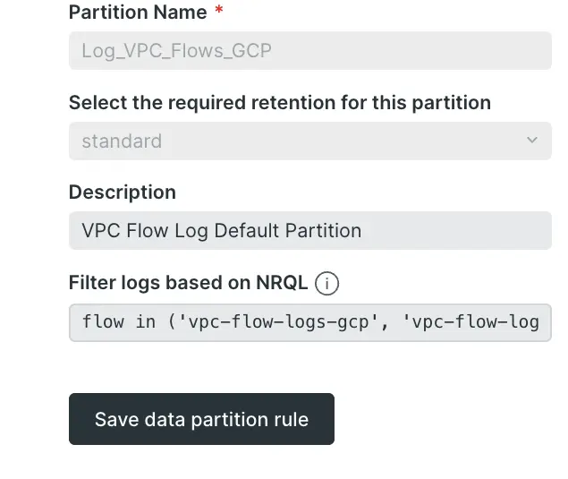

If your systems generate a massive amount of logs, then you probably already know and love the data partitioning capability in our logging product. This feature gives you control over retention and query times by setting up simple rules to segment ingested logs by any available attribute.

Our latest improvements have made it even easier to create log data partitions to give you exactly what you want. Now, rules can be specified using a simple NRQL `WHERE` clause when creating or modifying log data partitions.

Nothing will change about your current data partitions, but now you can see and adjust the criteria being used as a partition filter for more fine-tuned results.

For more information, see our [log partition docs](https://docs.newrelic.com/docs/logs/log-management/ui-data/data-partitions).
