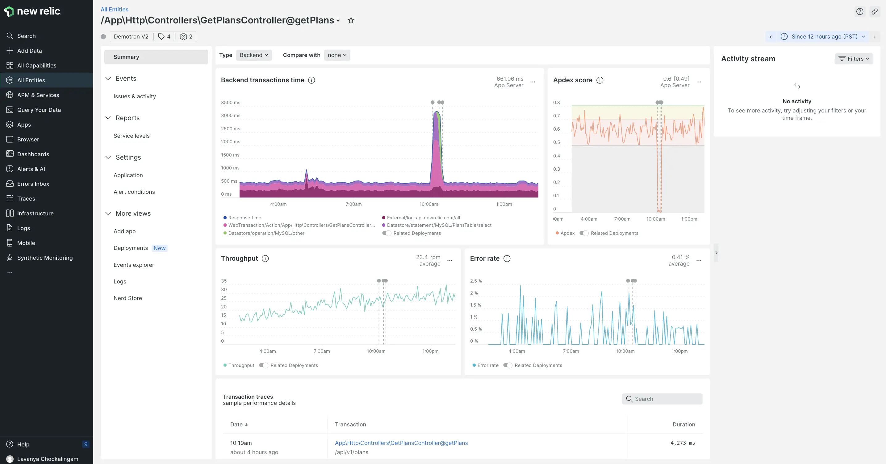

Key transactions help you track the most important business transactions that you want to monitor and manage regardless of the overall application throughput. To make key transactions more powerful, we have now made them a part of New Relic’s entity ecosystem. Now you can visualize key transactions in the context of all the other related entities to quickly isolate and troubleshoot issues. Also, key transactions don’t add additional data so there is no billing impact. Here are a few ways you can use the power of New Relic’s all-in-one observability platform to monitor your business critical transactions:

<ul>
    <li>View your key transactions across all accounts in one place under the entity listing.</li>
    <li>View key transactions along with their related services and entities by adding your key transactions to workloads.</li>
    <li>Alert on unusual behavior in key transactions using baseline/anomaly alerting and add them to dashboards.</li>
    <li>Track changes in your application codebase that impact your business critical transactions using change tracking.</li>
    <li>Ensure your key transactions are delivering on your business agreements by defining service levels.</li>
</ul>

