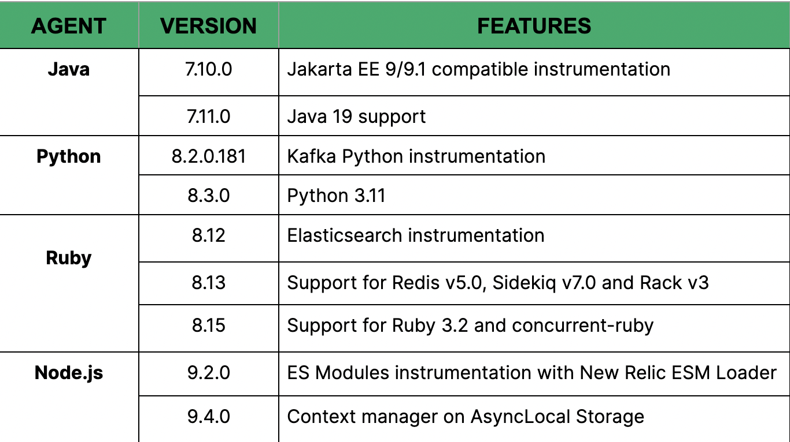

New Relic application performance monitoring (APM) provides the flexibility to monitor any part of your application. This is made possible through the power of New Relic agents, which collect your telemetry data and send it to New Relic. These agents are constantly updated to support new frameworks and language versions as they emerge.  Checkout the latest in language version and framework support for various agents below:

