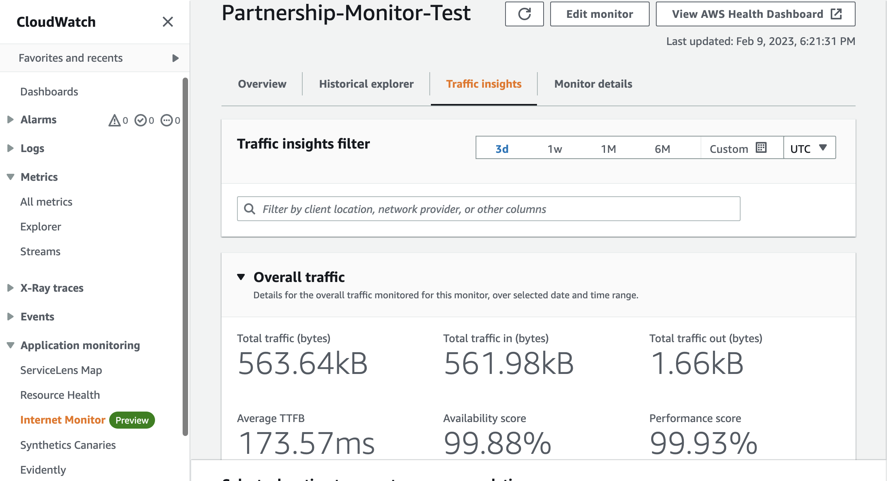
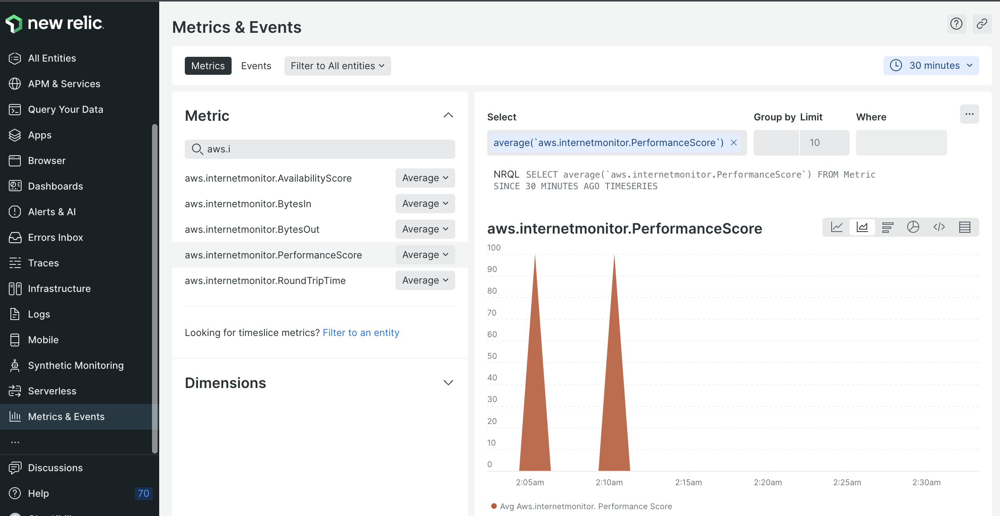
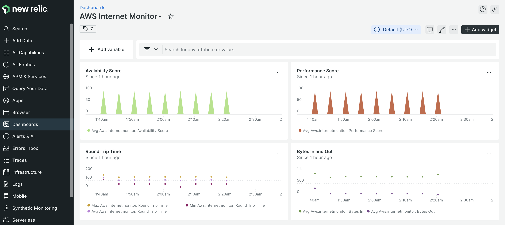

## Amazon CloudWatch Internet Monitor integration

New Relic is pleased to partner with AWS to allow joint customers send their CloudWatch Internet Monitor data to New Relic. 

Doing so, customers have an opportunity of continuous observability of internet measurements, such as availability and performance, tailored to their 
workload footprint on AWS.

Also it can be done without modifying application code, and without impacting the performance of workloads.

To prepare for this integration, be sure to link your Amazon and New Relic account either via 
[streaming](https://docs.newrelic.com/docs/apis/nerdgraph/examples/nerdgraph-streaming-export) (recommended) or via 
[polling](/docs/infrastructure/infrastructure-integrations/cloud-integrations/configure-polling-frequency-data-collection-cloud-integrations) methods. 

For the recommended streaming approach, an Amazon Kinesis Delivery stream and CloudWatch
Metric Stream should be set on your Amazon account. If "Metrics being streamed" aren't set to "All namespaces" in your CloudWatch Metric Stream, make sure "InternetMonitor" is selected. 

Once the integration has been enabled, wait for some time then look for your data in 
**[one.newrelic.com](https://one.newrelic.com/all-capabilities) > Metrics and events**, and then filter by `aws.internetmonitor`.

