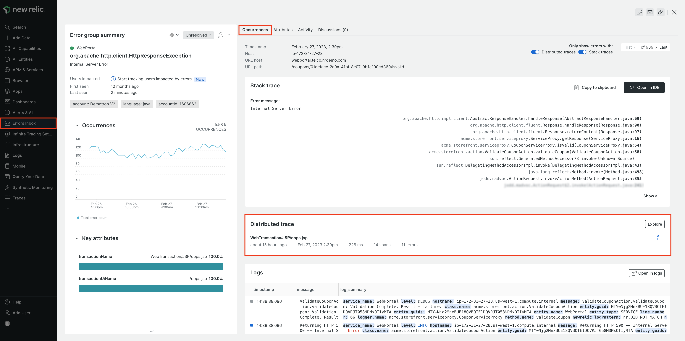
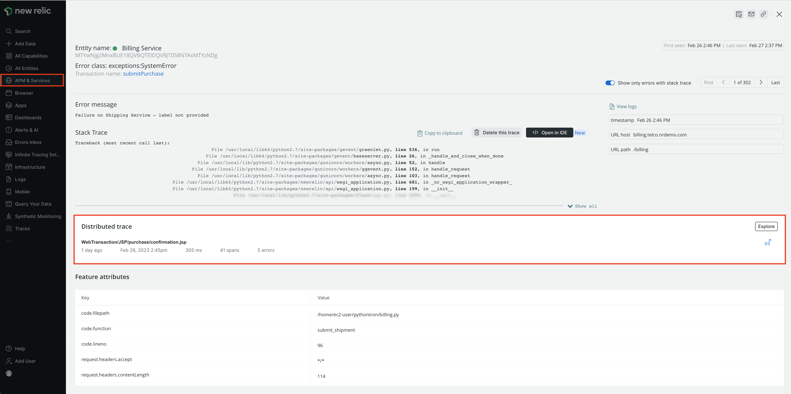
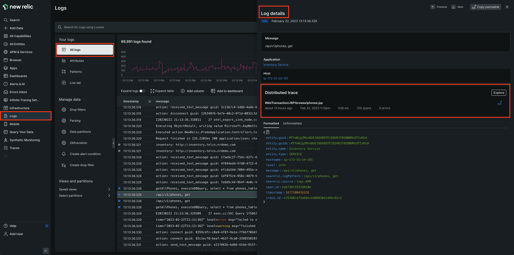

Distributed tracing already provides a powerful view of requests across your entire system. Now with traces in context, you will automatically get relevant information for related traces in errors inbox, APM errors, and logs. With this new capability, you can deep dive into a trace in one click without losing context to understand system complexity and performance with less toil.

<figcaption>View distributed traces in the occurrences tab of errors inbox</figcaption>

<figcaption>View distributed traces in the error group in the APM errors page</figcaption>

<figcaption>View distributed traces in the log details panel</figcaption>

## Get started
To start using traces in context, deploy or update to the latest [APM](https://docs.newrelic.com/docs/new-relic-solutions/new-relic-one/install-configure/update-new-relic-agent/), [browser](https://docs.newrelic.com/docs/browser/browser-monitoring/installation/install-browser-monitoring-agent/), and [mobile](https://docs.newrelic.com/docs/mobile-monitoring/new-relic-mobile/get-started/introduction-mobile-monitoring/) agents to each service involved in the call path you're interested in. Traces in context will be immediately available upon upgrading. You can view traces in the **Occurrences** tab of errors inbox, in the error group in the APM errors page, and in the log details panel.

## Learn more
Review the [distributed tracing documentation](https://docs.newrelic.com/docs/distributed-tracing/concepts/quick-start/) and read our [blog post](https://newrelic.com/blog/nerdlog/distributed-traces-errors-logs).

