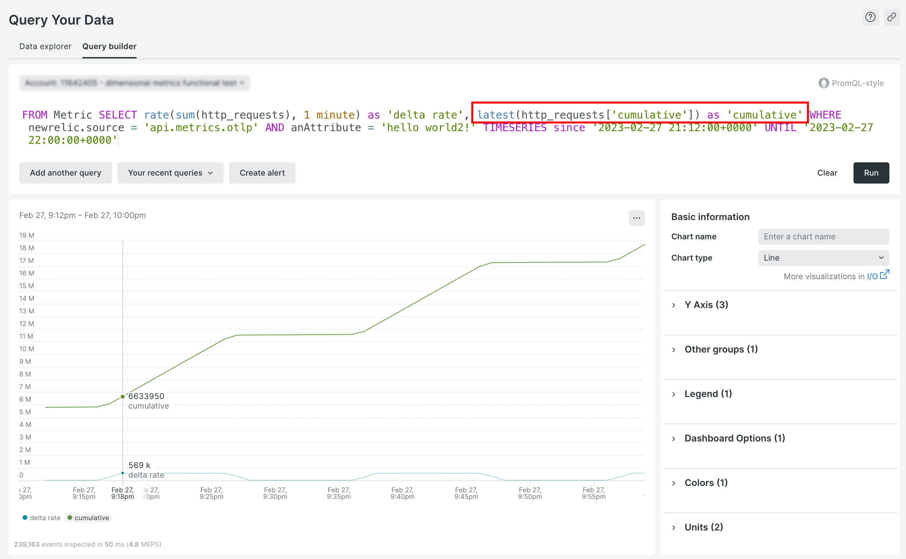

Get more insights into your Prometheus and OpenTelemetry data faster with cumulative metrics. Query and analyze your `cumulative` and `delta` values within a single platform without the need for any client-side configuration.

Cumulative counters are now stored as a New Relic `cumulativeCount` metric data type. For examples of querying OpenTelemetry cumulative metrics, see [our OpenTelemetry best practices](https://docs.newrelic.com/docs/more-integrations/open-source-telemetry-integrations/opentelemetry/best-practices/opentelemetry-best-practices-metrics/#query).

With this update, you can:

* **Get more insight into your data** by easily and efficiently querying both the `cumulative` and `delta` values. 
* **Eliminate the need for client-side configuration** to convert cumulative values to delta values before sending data to New Relic, saving valuable time and effort. 

**Next steps**

* Read our [cumulative metrics docs](https://docs.newrelic.com/docs/data-apis/understand-data/metric-data/cumulative-metrics).
* If you currently are using monotonic cumulative sum metrics in your queries or alerts, see the [Transition guide](https://docs.newrelic.com/docs/more-integrations/opentelemetry/get-started/cumulative-metrics-transition-guide).  
* Get started with [OpenTelemetry](https://docs.newrelic.com/docs/more-integrations/open-source-telemetry-integrations/opentelemetry/opentelemetry-introduction) or [Prometheus](https://docs.newrelic.com/docs/infrastructure/prometheus-integrations/get-started/send-prometheus-metric-data-new-relic) with New Relic.

