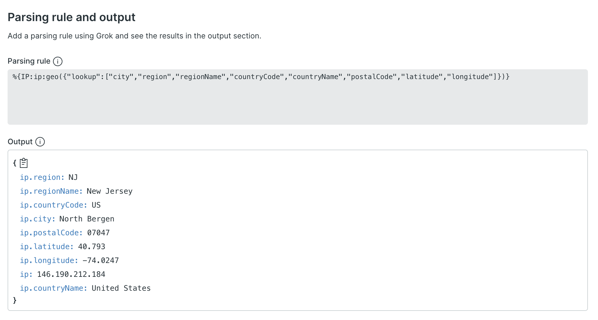

Everything on the internet has an address, and these addresses often end up in your logs. New Relic can now take these IP addresses, locate them in the world, and add related geographic information to your log events, making it possible to use attributes like "city", "countryCode", and "postalCode" when querying logs.

Create or update your parsing rules to get started slicing and dicing logs by their geography with this new functionality.

For more information, see our [log parsing docs](https://docs.newrelic.com/docs/logs/ui-data/parsing/#geo).
