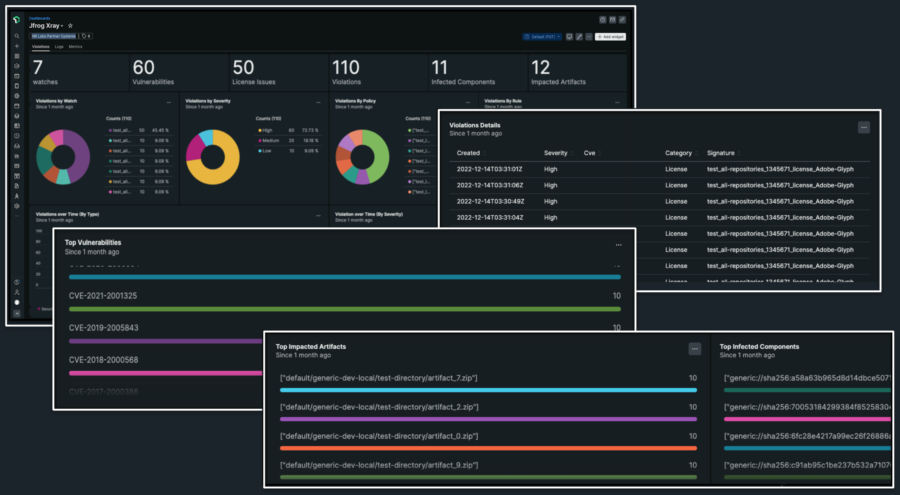

## Get real-time insights of your software supply chain in minutes

We've partnered with JFrog to provide DevOps, DevSecOps, and engineer teams full visibility and actionable insights into the performance and security of their software supply chains. 

The new [quickstart integration](http://newrelic.com/instant-observability/jfrog-platform) lets you monitor your **JFrog Artifactory** and **JFrog Xray** environments to help fine-tune your DevOps pipelines and ensure faster, seamless software releases. Plus, all New Relic full platform users and all tiers of self-hosted JFrog customers can access it for free! 

## Benefits

- **Faster and more secure software delivery.** Monitor all your JFrog applications, artifacts, and dependencies in real time with pre-built dashboards to correlate performance alongside the rest of your telemetry data in a unified view.
- **Better compliance and security.** Identify urgent vulnerabilities, identify malicious users, and allow your teams to deploy fixes faster to deliver more secure software with less toil.
- **Improved software supply chain performance.** Gain insights into the various stages of the software delivery pipeline, such as build, test, and deployment, to proactively manage performance degradation and remediate issues and boost release velocity and quality. 

<iframe width="560" height="315" src="https://fast.wistia.net/embed/iframe/d5ywdxo6qr" allow="accelerometer; autoplay; encrypted-media; gyroscope; picture-in-picture" frameBorder="0" allowfullscreen="false" class="css-1b4920d"></iframe>
<figcaption>The JFrog Artifactory dashboard helps you track performance and usage of your artifactory services and lets you audit users who access your instances. You can also directly view real time logs and entities in New Relic.</figcaption>

<figcaption>Uncover and mitigate vulnerabilities with the JFrog XRay dashboard.</figcaption>

## Get started

To start monitoring JFrog in New Relic:
- Read the [blog](https://newrelic.com/blog/how-to-relic/jfrog-integration) to see how to make the most of the integration
- Follow the [documentation](https://github.com/jfrog/log-analytics-newrelic#readme) to set up the integration with Fluentd and OpenMetrics
- Install the [quickstart](https://newrelic.com/instant-observability/jfrog-platform) to get the pre-built dashboards
- Watch the video below for a walkthrough demo

<iframe width="560" height="315" src="https://www.youtube.com/embed/nHHLvvlPlNQ" title="Monitoring the JFrog Platform in New Relic" frameborder="0" allow="accelerometer; autoplay; clipboard-write; encrypted-media; gyroscope; picture-in-picture; web-share" allowfullscreen></iframe>
